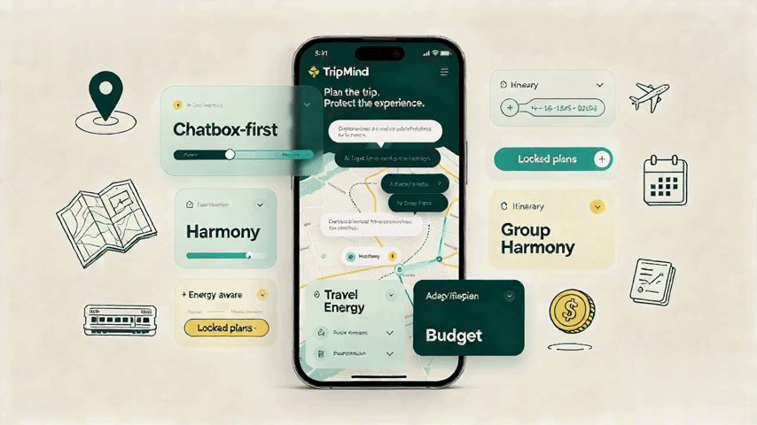
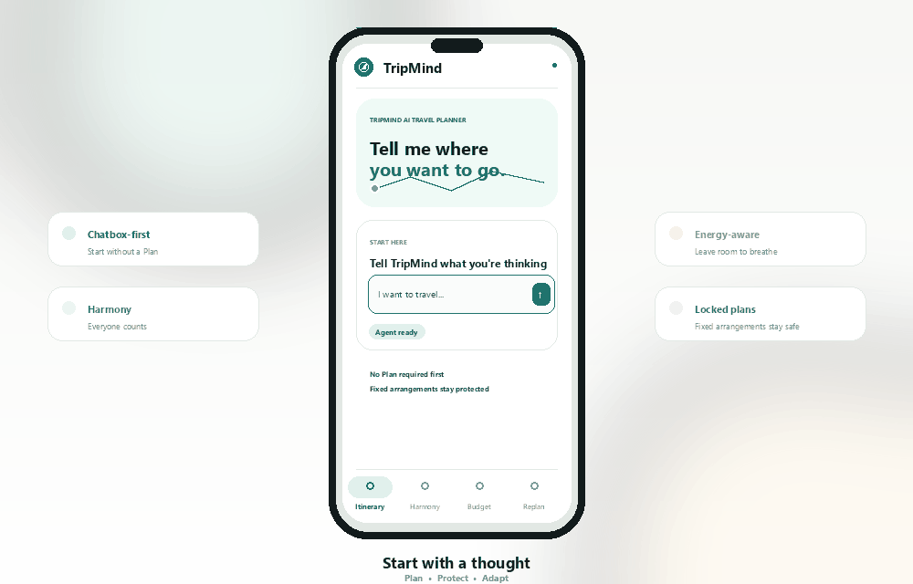
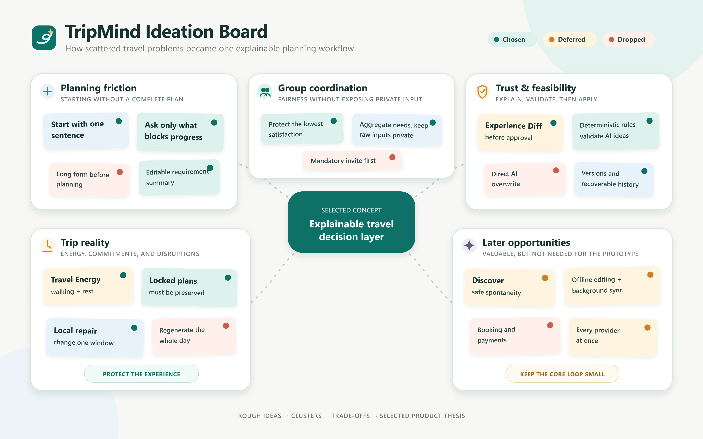
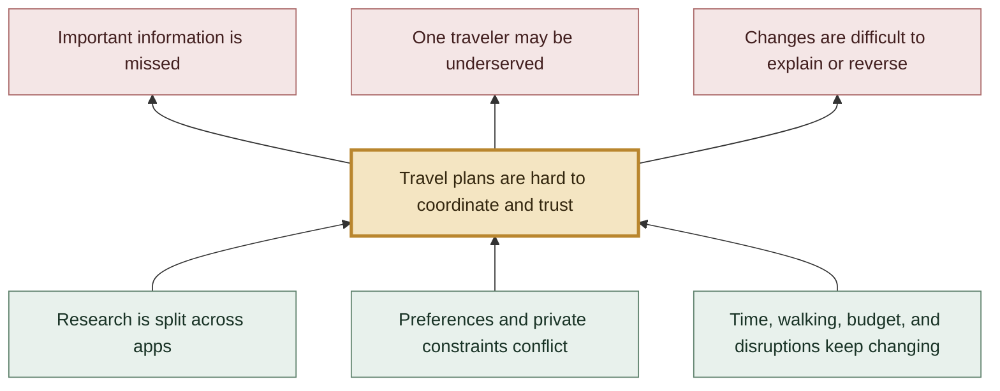
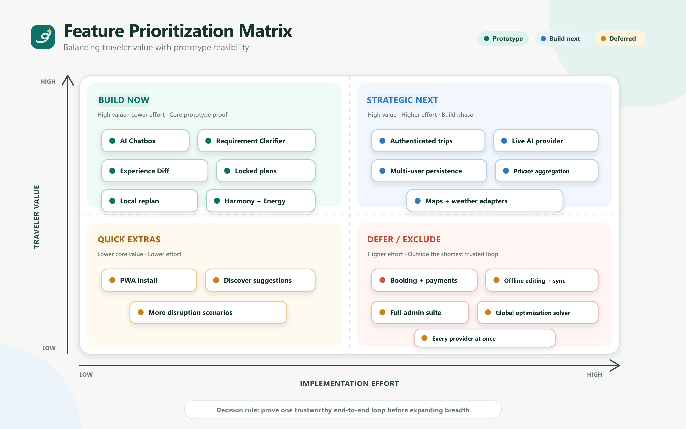
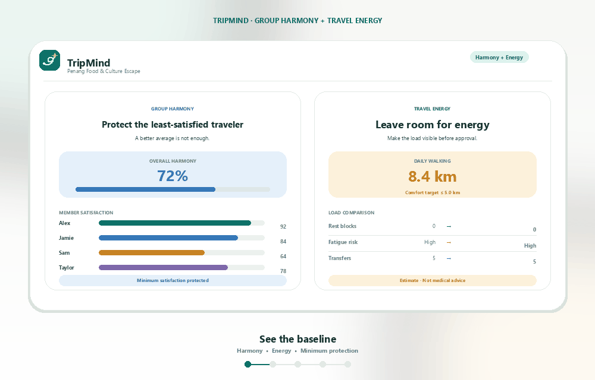
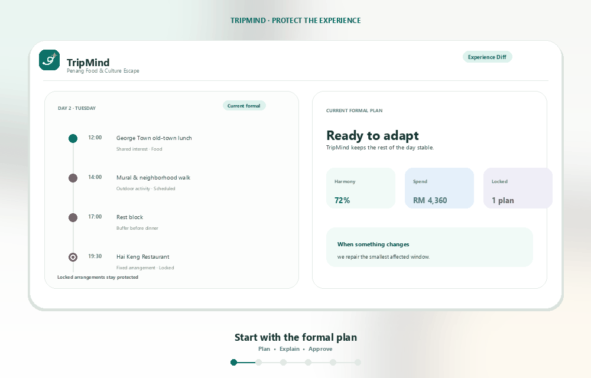
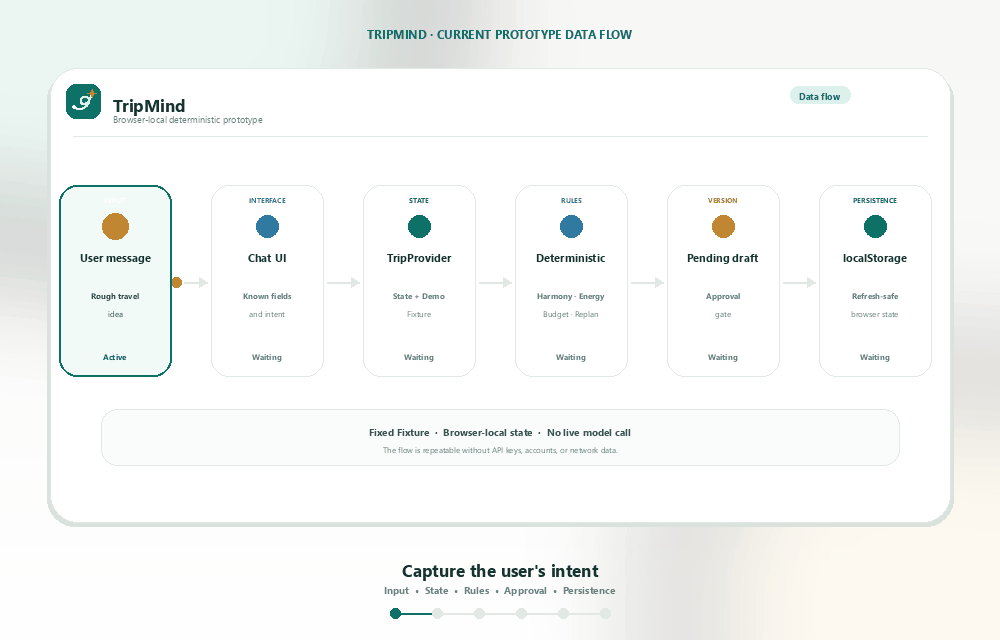

# TripMind by Teio

<p align="center">
  
</p>

<p align="center"><em>Explainable travel planning for calmer, more coordinated journeys.</em></p>

<p align="center">
  
  
  
  
  
  
</p>

<p align="center">
  
  
  
  
</p>

**Team:** Kong Wen Khang · Lim Jun Wei · Law Yong Soon

**Problem Statement:** Travel Planner

**Video Presentation:** [Watch the unlisted video](<https://mmuedumy-my.sharepoint.com/:v:/g/personal/kong_wen_khang_student_mmu_edu_my/IQD_vPn2FUQ8So6Cvz-G6IIaAfQzXqyb36JB3gejFtYc5Kk?e=uF2jrW>)

**Presentation Slides:** [View the presentation slides](<https://mmuedumy-my.sharepoint.com/:p:/g/personal/kong_wen_khang_student_mmu_edu_my/IQDf35jjq_lUQLsbxMwq0cYbAb98Doa-L8PfYsuBkQqWYMk?e=sX3Dpk>)

> Don’t just plan the trip. Protect the experience.

## Table of Contents

- [Project Overview](#1-project-overview)
- [Ideation & Process](#2-ideation--process)
- [Design & Prototype](#3-design--prototype)
- [What Makes It Different](#4-what-makes-it-different)
- [Technical Architecture & Feasibility](#5-technical-architecture--feasibility)
  - [Tech stack](#tech-stack)
  - [System architecture diagram](#system-architecture-diagram)
  - [Build plan & scope](#build-plan--scope)
- [Detailed Product and Implementation Reference](#6-detailed-product-and-implementation-reference)
  - [How to Use TripMind](#69-how-to-use-tripmind)
  - [Routes and Navigation](#610-routes-and-navigation)
  - [Versions, Drafts, and Approval Rules](#611-versions-drafts-and-approval-rules)
  - [Technology Stack](#614-technology-stack)
  - [Project Structure](#615-project-structure)
  - [Local Development](#616-local-development)
  - [Deployment and Verification](#617-deployment-and-verification)
  - [Validation Checklist](#618-validation-checklist)
  - [License](#623-license)

<p align="center">
  
</p>

TripMind is an explainable travel-planning product built around an AI Chatbox and a travel decision subsystem. It turns a natural-language travel idea into a structured itinerary that can be coordinated, evaluated, adapted, approved, and shared. A traveler can start with one sentence, answer only the questions that matter, and keep refining the plan as the trip evolves.

TripMind optimizes more than a list of places. Its travel decision subsystem protects the parts of a trip that matter in real life: whether the group can accept the plan, whether every traveler can physically handle it, how much budget remains, which arrangements are fixed, and which experiences are worth keeping when circumstances change.

## 1. Project Overview

**The Problem.** Travel planning is fragmented across search tools, group chats, maps, notes, and spreadsheets. This makes it hard for solo travelers and small groups to know what information is still missing, reconcile conflicting preferences, keep a plan within time, mobility, and budget limits, or recover cleanly when weather and delays disrupt the itinerary. The main stakeholders are travelers, trip organizers, invited friends or family members, and—when the product is extended—travel-data and service providers. Products such as [Wanderlog](https://wanderlog.com/) already combine itinerary organization, maps, reservations, budgets, collaboration, and AI planning; however, TripMind focuses on gaps that remain important for this project: protecting the least-satisfied traveler, making physical load explicit, preserving locked arrangements, and previewing a localized change before it becomes the formal plan.

**Our Solution.** TripMind is an explainable travel-planning product built around an AI Chatbox and a deterministic travel decision layer. It turns a rough natural-language idea into a structured itinerary, then keeps group preferences, physical load, budget, disruptions, approvals, and history connected to the same trip state. The Agent interprets intent and explains options, while rule-based services validate time, distance, buffers, budget, opening hours, member limits, and fixed arrangements. Every meaningful itinerary change remains a pending draft until the traveler reviews its Experience Diff and approves it.

**Feature set**

- Chatbox-first planning and requirement clarification.
- Constraint-aware itinerary generation and validation.
- Group Harmony scoring with minimum-member-satisfaction protection.
- Travel Energy estimates for walking, transfers, activity density, rest, and fatigue risk.
- Local disruption replanning that protects locked arrangements.
- Experience Diff previews before any formal change.
- Budget categories, remaining headroom, pending deltas, and version history.
- Privacy-aware solo and group collaboration.
- Discover / Surprise Me suggestions for usable free-time windows.
- Provider-independent contracts for AI, places, maps, routing, pricing, and weather.
- Business Scope Guard boundaries for travel-only Agent behavior.

## 2. Ideation & Process

### 2.1 Ideas We Considered

The table records every distinct product idea documented in the repository's current planning materials. Chosen ideas are listed first; “Deferred” means the idea remains part of the longer-term product direction but was intentionally removed from the present prototype scope.

| **Idea** | **Why it was dropped / kept** |
| --- | --- |
| Chatbox-first planning (Chosen) | Kept because a traveler can start with an unfinished idea instead of learning a long planning form. |
| Requirement Clarifier (Chosen) | Kept to separate confirmed inputs, missing essentials, and optional defaults before generation. |
| Constraint-aware itinerary (Chosen) | Kept because a visually attractive itinerary can still fail on time, transfers, walking, budget, opening hours, or fixed arrangements. |
| Explain-before-apply and Experience Diff (Chosen) | Kept so users can understand cost, effort, satisfaction, and schedule consequences before approving a new formal version. |
| Group Harmony (Chosen) | Kept because a group average can hide a traveler whose important needs are being ignored. |
| Travel Energy (Chosen) | Kept to make walking, activity density, transfers, rest, and fatigue risk visible planning variables. |
| Local disruption replanning (Chosen) | Kept so rain, delays, closures, or cancellations repair only the affected time window. |
| Locked-arrangement protection (Chosen) | Kept because reservations and other commitments must survive optimization and replanning unless the user explicitly unlocks them. |
| Budget planner and version history (Chosen) | Kept to show affordability, draft cost changes, remaining headroom, and a recoverable approval trail. |
| Solo-first, optional collaboration (Chosen) | Kept so one traveler can complete the core flow and invite others only after the first itinerary exists. |
| Privacy-aware preference aggregation (Chosen) | Kept so group conclusions can be shared without exposing exact private budgets, notes, or individual quotes by default. |
| Provider-independent adapters (Chosen) | Kept to prevent the state model and approval rules from depending on one AI, map, weather, or pricing vendor. |
| Business Scope Guard (Chosen for MVP architecture) | Kept to restrict the Agent to travel planning and prevent unrelated or unsafe requests from changing trip state. |
| Discover / Surprise Me (Chosen for extended scope) | Kept as a controlled way to fill a real free-time window using location, budget, preferences, and Energy. |
| Long form before planning (Dropped) | Dropped because it raises the barrier for travelers who do not yet know the answers; progressive clarification is the selected interaction. |
| Direct AI overwrite of the itinerary (Dropped) | Dropped because silent changes are hard to trust, audit, or reverse; drafts and approval are safer. |
| Full-day regeneration after every disruption (Dropped) | Dropped because it can destroy unaffected experiences and locked arrangements; local repair is more predictable. |
| Mandatory group setup before planning (Dropped) | Dropped because it blocks solo use and slows the first useful result; invitations are optional and come later. |
| Public display of raw member constraints (Dropped) | Dropped for privacy; the group view exposes only the aggregated information needed for coordination. |
| Exact global optimization in the MVP (Deferred) | Deferred because a transparent heuristic is feasible within the build phase and easier to validate than a global solver. |
| Simultaneous integration of every AI and travel provider (Deferred) | Deferred because the MVP needs one live provider plus a deterministic fixture fallback, while adapters preserve future choice. |
| Offline itinerary editing, background sync, and push notifications (Deferred) | Deferred because they expand state-conflict and privacy risk; the immediate PWA scope is responsive installation and reliable online recovery. |
| Full booking, payment, refund, and ticketing flows (Dropped from scope) | Dropped because TripMind is a planning and decision product, not a transaction platform. |
| Full internal administration suite (Deferred) | Deferred until the core traveler journey is stable so administrative work does not displace the planning loop. |
| Real-time in-trip tracking and final trip summaries (Deferred) | Deferred as later extensions; they are not required to prove the core planning, comparison, and approval loop. |

### 2.2 Ideation Boards

#### Affinity diagram

<p align="center">
  
</p>

This board groups the team's ideas around planning friction, group coordination, trust, real-world trip constraints, and later opportunities. It preserves both the chosen direction and the ideas that were deferred or dropped during scope reduction.

#### Problem tree



The problem tree keeps the diagnosis separate from the intervention: causes sit below the trunk, the coordination-and-trust problem is the trunk, and the resulting failure modes branch above it. The selected TripMind features address those failure modes through clarification and validation, Harmony and Energy, and local replanning with Experience Diff and version approval.

#### Feature prioritization matrix

<p align="center">
  
</p>

The matrix shows why Chatbox planning, requirement clarification, Experience Diff, locked-plan protection, local replanning, Harmony, and Energy form the prototype core. Live providers and authenticated persistence move into the build phase, while transaction, offline-sync, and administration work remain outside the shortest trusted loop.

#### Selected user flow

This flow shows how the chosen ideas were reduced to one coherent journey: clarify first, create a formal itinerary, then add Harmony, Energy, Adapt, Budget, and approval around that shared state.

#### Responsibility and feasibility

This section captures the team's key feasibility decision: AI handles language and explanation, while deterministic services own calculations, validation, permissions, approval, and formal writes.

## 3. Design & Prototype

**UI Prototype:** [Open the live prototype](https://tripmind-ai-xi.vercel.app/) · [Source repository](https://github.com/teio980/tripmind-ai)

The public prototype link must be tested in an incognito window before submission. The current repository contains the following key interactions and routes:

### Key screens

| Key screen / interaction | Route | What the reviewer can test |
| --- | --- | --- |
| Home AI Chatbox | `/` | Start with a rough travel idea and enter the planning flow. |
| Agent clarification and review | `/chat/demo` | Add or remove requirements, then confirm the inputs used for generation. |
| Itinerary and Travel Energy | `/trips/penang-demo/itinerary` | Review the day-by-day plan and open the Energy comparison panel. |
| Group Harmony | `/trips/penang-demo/consensus` | Inspect group preferences, per-traveler satisfaction, and a candidate optimization. |
| Disruption replanning | `/trips/penang-demo/replan` | Compare rain alternatives while preserving the locked dinner. |
| Budget and version approval | `/trips/penang-demo/budget` | Review costs, pending changes, approval state, and version history. |

#### Chatbox-to-itinerary flow

The traveler moves from an incomplete idea to clarified requirements and an inspectable itinerary without filling a long form first.

#### Harmony and Energy review

<p align="center">
  
</p>

The group can see who benefits, who may be underserved, and how a lower-load candidate changes walking, rest, transfers, and fatigue risk.

#### Disruption and Experience Diff

<p align="center">
  
</p>

A rain event affects only the relevant afternoon window; alternatives expose trade-offs and keep the locked dinner unchanged until approval.

#### AI and deterministic decision flow

This flow explains what the Agent may propose and what the deterministic layer must validate before a draft can become formal state.

## 4. What Makes It Different

| Novel feature | Original angle or TripMind twist |
| --- | --- |
| Group Harmony with minimum-satisfaction protection | TripMind does not stop at a single average score; it surfaces each traveler and protects the least-satisfied member during optimization. |
| Travel Energy | Walking, transfers, consecutive activities, early starts, late finishes, and rest become comparable itinerary metrics rather than afterthoughts. |
| Experience Diff and approval | AI suggestions are treated as drafts. Users see retained experiences, trade-offs, cost, risk, and fixed-arrangement impact before a new version is written. |
| Local disruption repair | The planner repairs the affected window instead of regenerating an entire day and potentially losing commitments. |
| Locked-arrangement validation | A reservation is not merely displayed; it becomes a hard constraint that every candidate must preserve and revalidate. |
| Privacy-aware collaboration | The system coordinates aggregated needs while keeping raw private budgets, quotes, and sensitive notes scoped to their owners. |
| AI/deterministic separation | Natural-language interpretation remains flexible, while authoritative calculations, permissions, validation, and writes stay rule-based and traceable. |
| Stateful travel object | Requirements, formal versions, pending drafts, events, costs, and explanations stay attached to one maintainable trip rather than disappearing into chat history. |

The detailed comparison with Wanderlog appears in [Positioning and Differentiation](#66-positioning-and-differentiation).

## 5. Technical Architecture & Feasibility

### Tech stack

| Layer | Prototype implementation | Why it was chosen | Expected constraint / next step |
| --- | --- | --- | --- |
| Frontend | Next.js 15 App Router, React 19, TypeScript, CSS, Lucide React | Fast component-based development, typed state, responsive routing, and a familiar deployment path. | The current prototype is client-heavy; production-sensitive operations must move behind server routes. |
| State | React Context with browser `localStorage` persistence | Keeps the multi-route demo coherent across refreshes without backend setup. | It is single-device prototype storage, not secure multi-user persistence. |
| Data | Deterministic Penang fixture | Makes the demo reliable and keeps calculations reproducible. | Costs, routes, weather, Harmony, Energy, and satisfaction are estimates rather than live data. |
| Backend | Not connected in the current prototype; planned Next.js Route Handlers and domain services | Keeps API, validation, permission, and provider boundaries in the same TypeScript application. | The build phase must implement authentication, schema validation, error handling, and server-only secrets. |
| Database and auth | Not connected in the current prototype; Supabase Postgres, Auth, and Row Level Security are planned for the MVP | Provides relational trip/version data, authentication, and scoped access with a practical free tier. | RLS policies, grants, server-side aggregation, migrations, and a server proxy are required before storing private group data. |
| AI and travel APIs | Replaceable provider contracts are planned; the prototype currently uses fixtures | Avoids coupling TripMind's state and approval model to a single AI, maps, places, routing, pricing, or weather vendor. | The MVP should connect one live provider per required capability and retain fixture fallback for a stable demo. |
| Hosting | Planned for a Next.js-compatible HTTPS platform such as Vercel | Supports App Router deployment, route handlers, environment variables, and PWA delivery. | A public URL has not been recorded in this repository and must be verified in an incognito window. |
| PWA | Web App Manifest and standalone display configuration | Makes the mobile-first experience installable with a small implementation footprint. | Service worker caching, offline editing, background sync, and push notifications are outside the current prototype scope. |

### System architecture diagram

<p align="center">
  
</p>

The browser presents trip state and sends user actions. In the planned MVP, authenticated route handlers run the Business Scope Guard, the Agent coordinates only permitted travel tools, deterministic services validate every candidate, and persistence stores a new formal version only after approval.

### Build plan & scope

| Scope | What will be built or retained |
| --- | --- |
| Current prototype | Six navigable product areas covering Chatbox clarification, generation review, itinerary, Harmony, Energy, Adapt, Budget, pending drafts, approval, version history, reset, responsive layout, and PWA manifest behavior using a deterministic Penang fixture. |
| Build phase—core | Add server-side scope checks, one live AI provider, structured Agent output, deterministic validation, authenticated trip persistence, and the complete Chatbox-to-first-itinerary loop. |
| Build phase—decision layer | Persist locked arrangements and versions; complete local disruption repair, Experience Diff, Harmony, Energy, budget checks, approval, cancellation, and stale-draft protection. |
| Build phase—collaboration | Add solo-first accounts, invitation links, member roles, private preference storage, and safe group-level aggregation. |
| Build phase—deployment and QA | Deploy over HTTPS, configure secrets, validate direct routes and refresh recovery, test mobile and desktop layouts, run type/build checks, and verify every public submission link in an incognito window. |
| Explicitly outside this build | Booking, payment, refunds, a global optimization solver, offline editing, background sync, push notifications, every provider integration at once, and the full internal admin suite. |

The intentionally narrow delivery target is one trustworthy end-to-end loop: a traveler starts with a rough idea, confirms the minimum requirements, receives a validated itinerary, previews one meaningful change or disruption response, and approves it as a recoverable new version.

## 6. Detailed Product and Implementation Reference

### 6.1 Product Overview

TripMind connects the complete travel-planning journey into one stateful workflow:

```text
Rough idea
   ↓
AI Chatbox clarification
   ↓
Structured requirement review
   ↓
Constraint-aware itinerary
   ↓
Harmony coordination + Energy optimization
   ↓
Adaptation to disruptions
   ↓
Budget review, Experience Diff, and version approval
```

The subsystem is organized around four connected capabilities:

- **Harmony**: turn individual preferences into a plan the group can accept while protecting the least-satisfied traveler.
- **Energy**: account for walking, activity density, transfers, early starts, late finishes, and rest so the itinerary remains comfortable.
- **Adapt**: repair the affected part of a trip when weather, delays, closures, or cancellations occur.
- **Discover**: recommend controlled, spontaneous experiences during an available time window based on location, budget, preferences, and Energy.

### 6.2 Who It Is For

TripMind is designed for solo travelers and small groups of 1–8 friends or family members.

| User | Common problem | TripMind helps by |
| --- | --- | --- |
| Traveler with no plan | They know they want to travel but do not know where to begin | Starting with one sentence and asking only the necessary follow-up questions |
| Trip organizer | Opinions, links, and changes are scattered across group chats and spreadsheets | Summarizing preferences, explaining conflicts, and maintaining one shared itinerary |
| Budget-sensitive traveler | They want to avoid overspending without exposing an exact private limit | Showing category budgets, remaining headroom, and option-level cost changes |
| Traveler with dietary or mobility needs | “Everyone is fine with it” can hide an individual limitation | Treating important needs as constraints and protecting minimum satisfaction |
| Solo traveler | Search results are plentiful but difficult to combine into a realistic day | Producing a schedule with time, movement, estimated cost, and buffers |

Typical use cases include:

- Starting with “I want to travel” and deciding what information is needed next.
- Generating an itinerary after providing a destination and trip length.
- Coordinating different interests, budgets, dietary needs, and Energy levels.
- Adjusting a day because someone wants a later start or a different activity.
- Replanning an afternoon after rain, a delay, a closure, or a cancellation.
- Comparing a lower-cost, lower-walking, or higher-interest alternative before approving it.

### 6.3 The Problem TripMind Solves

Travel planning usually splits destination research, group discussion, budgeting, itinerary editing, and disruption handling across several tools. TripMind connects these steps:

- A user with only a vague travel idea does not need to understand a planning data model first.
- The Agent asks about information that actually blocks generation and does not repeat known details.
- An itinerary is a structured, maintainable travel object instead of a one-time chat response.
- Group preferences, dietary needs, budgets, and Energy constraints can be summarized and coordinated.
- Time, distance, opening hours, budget, fixed arrangements, and member limits are checked before a candidate becomes formal.
- A disruption repairs the affected time window instead of forcing the user to rebuild the whole day.
- Every meaningful change explains what changed, why it changed, what it costs, and who may be affected.
- A proposed change becomes formal only after the user reviews and approves it.

### 6.4 Core Features

#### 1. Chatbox-first planning

The Chatbox is the primary entry point. Users can begin with “I want to travel, but I do not have a plan yet,” or provide a destination, trip length, interests, pace, or an itinerary change directly.

The Agent extracts what is already known and prioritizes destination and date or trip length because those are the fields needed to start generation. Optional details such as travelers, interests, and pace can be added later or filled with clearly labeled defaults.

#### 2. Explain before apply

TripMind does not silently overwrite the current itinerary. When a user asks to start later, optimize Harmony, reduce walking, or respond to rain, the system creates a pending draft based on the current formal version and shows an Experience Diff.

Only approval turns the draft into the next formal version. Closing, canceling, or skipping a preview leaves the current itinerary unchanged.

#### 3. Group Harmony

Harmony is more than one group score. It shows:

- Overall Harmony Score.
- Estimated satisfaction for each traveler.
- The least-satisfied traveler.
- Shared preferences and unresolved conflicts.
- Activities that were replaced, reordered, or protected.
- Reasons behind the proposed adjustments.
- Which information is an aggregated group conclusion and which remains private.

The goal is not to maximize an average while sacrificing one person. An optimization should improve the overall experience while protecting minimum member satisfaction.

#### 4. Travel Energy

Travel Energy makes “will this be too tiring?” a visible planning discussion. It accounts for:

- Daily walking distance.
- Activity count and consecutive activity duration.
- Cross-area transfer count.
- Early starts, late finishes, and rest blocks.
- Personal walking limits and comfort targets.
- Estimated fatigue risk.

The itinerary page opens Energy as an in-context panel. Travelers can compare a baseline with a lower-load candidate before deciding whether to apply it. Walking and fatigue values are planning estimates, not medical advice.

#### 5. Constraint-aware itinerary planning

TripMind separates natural-language understanding from deterministic validation:

- The Agent understands intent, organizes candidates, and explains trade-offs.
- Deterministic logic checks time, distance, transfer buffers, budget, opening hours, locked arrangements, and member constraints.
- A candidate that fails validation cannot silently become the formal itinerary.
- Locked arrangements remain visibly locked and must be preserved by optimizations and replans.

#### 6. Disruption Replanner

When a disruption occurs, TripMind:

1. Identifies affected activities and time windows.
2. Preserves arrangements that the user has locked.
3. Generates alternatives with different trade-offs.
4. Checks end times, travel, and buffers for each candidate.
5. Shows a standardized Experience Diff.
6. Lets the user choose and approve the result.

#### 7. Budget and version control

Budget review brings the total budget, category budgets, current spend, remaining headroom, draft changes, and version history into one place. Users can see whether a proposal changes accommodation, food, transport, or activity costs, and what happens if they cancel it.

Every formal version keeps its change label, estimated spend, and key metrics. Older versions remain available. Version numbers increase from the formal version that exists at the moment of approval; no feature is permanently tied to a specific version number.

#### 8. Privacy-aware collaboration

TripMind distinguishes private member input from aggregated group results. A group view can show shared preferences, coordination needs, and system reasoning without exposing exact private budgets, private quotes, or sensitive notes by default.

Inviting travelers is optional and happens after the first itinerary exists. A solo traveler can use the core product without inviting anyone.

#### 9. Provider-independent intelligence

AI, place, map, routing, pricing, and weather capabilities connect through replaceable adapters. The same `TripState`, validation, approval, permission, and explanation contracts apply regardless of the selected provider. This keeps the product consistent while allowing regional data and service choices to change safely.

### 6.5 Complete Capability Map

| Module | Problem addressed | Key capabilities |
| --- | --- | --- |
| AI Chatbox | The user does not know how to begin | Natural-language entry, scope checking, requirement extraction, guided questions |
| Requirement Clarifier | Information is incomplete or repeatedly entered | Remembered conditions, missing-field prompts, editable requirement card |
| Itinerary Planner | A generated plan looks good but cannot be executed | Daily timeline, movement, cost, buffers, and constraint validation |
| Trip / Plan Management | The plan exists only in one conversation | Independent trip object, stable entry point, saved versions, continued edits |
| Collaboration | Group opinions are scattered across chat | Invitations, preference collection, aggregated conclusions, voting, roles |
| Group Harmony | Average satisfaction hides an outlier | Shared preferences, conflict detection, member satisfaction, minimum protection |
| Travel Energy | Dense schedules and walking create fatigue | Walking, activity density, transfers, rest, and fatigue-risk assessment |
| Adapt / Replanner | A disruption invalidates part of the schedule | Event detection, local repair, locked-item protection, Experience Diff |
| Budget Planner | The user cannot see the cost of a plan | Total budget, category limits, remaining budget, candidate cost comparison |
| Discover / Surprise Me | Free time is difficult to use intentionally | Safe / Balanced / Adventurous suggestions |
| Version and Approval | Users cannot tell what a change will do | Pending drafts, impact previews, version history, traceable reasons |

First-time planning starts with the Chatbox, Requirement Clarifier, and Itinerary Planner. Harmony, Energy, Adapt, Budget, and Discover then enrich the same itinerary and state model.

### 6.6 Positioning and Differentiation

TripMind is an **explainable decision layer for a shared trip**, rather than only an itinerary organizer. It turns a rough request into a structured plan, makes group and physical-load trade-offs visible, and asks for approval before changing the formal plan.

#### Comparison with Wanderlog

Wanderlog is a useful reference point because it provides a broad trip-organizing toolkit: itineraries and maps, reservations, budgeting, route optimization, collaboration, mobile apps, offline access, and live flight updates. [Wanderlog’s product page](https://wanderlog.com/) describes those capabilities. The comparison below is about product focus.

| Dimension | Wanderlog emphasis | TripMind differentiation |
| --- | --- | --- |
| Starting point | Build and organize a trip with itinerary, map, reservations, and AI planning tools | Begin with one natural-language idea; the Chatbox asks only for the information that blocks a first itinerary |
| Collaboration | Share and collaboratively edit a trip in real time | Model group satisfaction, conflicts, and the least-satisfied traveler so the organizer can explain a trade-off |
| Physical load | Show time and distance between itinerary stops | Make walking, transfers, activity density, rest, comfort targets, and fatigue risk an explicit Energy decision |
| Fixed arrangements | Store reservations and schedule details | Treat a user-locked arrangement as a constraint that every proposed optimization and replan must preserve and revalidate |
| Disruptions | Offer live flight-status information alongside planning tools | Repair only the affected window, protect fixed arrangements, and present alternatives through a structured Experience Diff |
| Comparing options | Organize the itinerary and its associated trip information | Compare Harmony, minimum satisfaction, budget, walking, fatigue and weather risk, retained experiences, and fixed-arrangement impact in one review |
| Applying changes | Collaborative changes can be made directly to the shared plan | Create a pending draft first; only an approved, validated draft becomes the next formal version |

TripMind treats a trip as an explainable, collaborative, and approvable state object rather than a static checklist. Its product thesis is to protect group satisfaction, walking load, fixed arrangements, and experience quality whenever a plan changes.

### 6.7 Product Decisions

| Idea | Decision | Reason | Product behavior |
| --- | --- | --- | --- |
| Chatbox-first planning | Adopted | A traveler should be able to begin with a rough idea instead of learning a long planning form. | The Chatbox extracts known details and asks only for the destination and date range or trip length needed to generate. |
| Group Harmony | Adopted | A group average can hide a traveler whose important need is being ignored. | The subsystem surfaces shared preferences, conflicts, per-member satisfaction, and minimum-satisfaction protection before a Harmony draft is approved. |
| Travel Energy | Adopted | A route that fits on a map can still be too tiring in practice. | Energy compares walking, transfers, rest blocks, and fatigue risk with a lower-load candidate. |
| Adapt / Replanner | Adopted | A disruption should not force the group to rebuild a whole day. | The affected window is repaired, time and buffers are validated, and fixed arrangements remain intact. |
| Experience Diff | Adopted | Users need to see the consequence of a change before they accept it. | Pending drafts compare cost, Harmony, minimum satisfaction, walking, risk, retained experiences, and fixed-arrangement impact. |
| Provider adapters | Adopted | Travel data and intelligence providers vary by market and service. | AI, places, maps, routing, pricing, and weather connect through explicit contracts without changing `TripState` or approval rules. |

### 6.8 Agent Scope and Safety

The TripMind Agent is a travel-state orchestrator, not a general-purpose chatbot. It can help with:

- Destinations, dates, trip length, origin, and travel pace.
- Itinerary generation, itinerary changes, routes, transport, budget, and weather impact.
- Group preferences, dietary needs, physical constraints, Harmony, Energy, and disruption replanning.
- Help with using TripMind itself.

It does not handle ticket purchases, hotel reservations, payments, refunds, or other transactions. It also does not handle code, homework, general copywriting, news or political commentary, investment advice, or unrelated medical or legal questions. Travel-related health, visa, and severe-weather questions receive planning-level cautions and official-information guidance, not diagnosis, legal conclusions, or safety guarantees.

A `Business Scope Guard` sits before and after the Agent:

- Out-of-scope messages are blocked before Agent or domain-tool calls.
- Mixed requests pass only the travel portion to the Agent and explain what was excluded.
- Unknown intent, invalid structured output, or a tool-permission mismatch defaults to rejection.
- The Agent cannot directly write to the database, modify locked arrangements, grant permissions, or call arbitrary external services.
- Major itinerary changes require a structured preview, deterministic validation, and user approval.

This boundary keeps the model responsible for understanding and explanation while system rules remain responsible for facts, calculations, permissions, and final writes.

### 6.9 How to Use TripMind

The following walkthrough covers the complete experience using a Penang starter itinerary as a concrete travel workspace.

#### 1. Start with a travel idea

Open the home page and enter a sentence in the Chatbox, for example:

```text
I want to travel, but I don't have a plan yet
```

You can also try:

- I want to go to the beach
- Plan a 3-day food trip
- Create a Penang itinerary for three days

Click send to enter the Agent follow-up page. If the request is unrelated to travel, TripMind explains that it handles travel planning and itinerary management and does not create unrelated state.

#### 2. Answer the Agent’s necessary questions

The Agent prioritizes:

- Destination.
- Date range or trip length.

The `Current requirements` card shows what has been remembered. Destination, duration, interests, and pace values can be removed individually; removing a value returns it to the missing or optional state.

#### 3. Review requirements and generate the itinerary

When destination and trip length are available, the pre-generation review shows:

- Destination, duration, travelers, and shared interests.
- Optional defaults such as relaxed pace and activity budget.
- Member constraints and fixed arrangements.
- Whether information comes from user input, connected travel data, or a system estimate.

Select `Generate itinerary`. The generation screen shows five stages:

1. Understand requirements: read destination, duration, travelers, and preferences.
2. Find activity candidates: match activities from connected travel data.
3. Estimate routes and costs: estimate travel, transfers, and costs.
4. Validate hard constraints: check dietary needs, walking limits, transport, fixed arrangements, and time buffers.
5. Save Version 1: save the first formal itinerary.

#### 4. Review the itinerary

The itinerary page includes:

- A day-by-day timeline.
- Start and end times.
- Activity duration and movement between stops.
- Estimated walking and transfer load.
- Estimated cost and category budget.
- Locked arrangements.
- `Ask Agent` for a targeted change.
- Energy and Harmony panels.

#### 5. Compare and approve a change

For a later start, lower walking load, Harmony optimization, or disruption response:

1. The Agent creates a pending draft from the current formal version.
2. The system validates the draft against time, movement, budget, member, and fixed-arrangement constraints.
3. Experience Diff summarizes changed activities, retained experiences, trade-offs, cost, Harmony, minimum satisfaction, walking, and risk.
4. The traveler approves or cancels the draft.
5. Approval creates the next formal version and preserves the prior version in history.

#### 6. Use Harmony, Energy, Adapt, and Budget

The dedicated panels provide:

- **Harmony**: shared preferences, conflicts, per-member satisfaction, the least-satisfied traveler, and optimization reasons.
- **Energy**: walking, transfers, rest blocks, activity density, and fatigue-risk comparison.
- **Adapt**: disruption details, affected window, preserved arrangements, alternatives, and Experience Diff.
- **Budget**: category limits, current spend, remaining headroom, draft deltas, and version history.

### 6.10 Routes and Navigation

The application provides the following product areas:

| Area | Purpose |
| --- | --- |
| Home Chatbox | Start a travel request and enter the planning workflow |
| Agent planning | Clarify requirements and review generation inputs |
| Itinerary | Review the timeline, movement, Energy, and Agent actions |
| Harmony | Coordinate group preferences and satisfaction |
| Adapt | Replan an affected time window and compare alternatives |
| Budget | Review costs, pending drafts, and version history |

The trip area uses desktop top navigation and a mobile bottom navigation. The UI adapts to narrow screens; Agent and Energy open as drawers. The project also includes a PWA manifest and standalone display configuration.

#### Product routes

| Route | Page | Purpose |
| --- | --- | --- |
| `/` | Home / AI Chatbox | Start with a rough idea and enter the planning workflow |
| `/chat/demo` | Agent follow-up | Clarify destination and duration; review current requirements |
| `/chat/demo?stage=ready` | Pre-generation review | Confirm requirements before generating the itinerary |
| `/trips/penang-demo/itinerary` | Itinerary | View the timeline, metrics, Agent edits, and invitations |
| `/trips/penang-demo/itinerary?panel=energy` | Travel Energy | Compare and approve a lower-walking plan |
| `/trips/penang-demo/consensus` | Group Harmony | View preferences, satisfaction, and Harmony optimization |
| `/trips/penang-demo/replan` | Adapt | Review a disruption and choose a local replan |
| `/trips/penang-demo/budget` | Budget and version review | Compare costs, view history, and approve drafts |

#### Penang reference itinerary

The Penang workspace illustrates a three-day food and culture itinerary with explicit group constraints and a protected dinner arrangement:

| Item | Value |
| --- | --- |
| Trip name | Penang Food & Culture Escape |
| Trip ID | TRP-PEN-2403 |
| Destination | Penang, Malaysia |
| Duration | 3 days |
| Travelers | Alex, Jamie, Sam, Taylor |
| Total budget | RM 4,800 for the whole group and trip |
| Shared interests | Food, culture, relaxed pace |
| Dietary constraint | Sam · Vegetarian |
| Walking constraints | Daily hard limit 9.0 km; comfort target ≤5.0 km |
| Group preference | Taylor · Preserve shopping time |
| Fixed arrangement | Day 2 · 19:30 · Hai Keng Restaurant dinner |
| Disruption event | Day 2 · 13:30 heavy rain affecting 14:00–17:00 outdoor activities |

The baseline budget is organized by stay, food, transport, and activities. The formal itinerary begins at RM 4,360 against the RM 4,800 total limit, leaving RM 440 of headroom. A recommended lower-walking rain alternative adds RM 40 of transport, bringing the estimated total to RM 4,400 and preserving RM 400 of headroom.

The Experience Diff compares three disruption strategies:

- **Least walking**: move the replacement indoors and reduce cross-town transfers; lower fatigue risk with a RM 40 increase.
- **Keep more interests**: preserve more cultural coverage with additional transport and activity cost.
- **Lower budget**: use a nearby indoor option to reduce transport cost while accepting lower cultural coverage.

All alternatives preserve the locked Day 2 dinner and validate the replacement end time, transfer, and dinner buffer before approval.

### 6.11 Versions, Drafts, and Approval Rules

TripMind stores the current formal itinerary separately from pending candidates:

1. The five-stage generation flow creates the first formal Version 1 after the itinerary passes hard-constraint validation.
2. An edit, Harmony optimization, Energy optimization, or Replan starts as a Pending draft based on the current version.
3. The draft records `baseVersion`, its reason, creation time, and expiration time.
4. Approval verifies that the draft still targets the current version and has not expired.
5. A valid draft creates `currentVersion + 1` and preserves older history.
6. If the formal version changed or the draft expired, the draft cannot be approved and must be regenerated.
7. Canceling a draft, skipping an enhancement, or closing a preview does not change formal metrics or the version number.

Example version sequence:

```text
Version 1: first itinerary
→ Version 2: approve “start Day 2 later”
→ Version 3: approve Harmony
→ Version 4: approve Energy
→ Version 5: approve the rain replan
```

Version numbers are not tied to specific features. If a step is skipped, later approvals continue from the formal version that actually exists.

### 6.12 Persistence and Reset

In the current prototype, trip state is persisted only in the current browser through `localStorage`, which keeps the formal itinerary, pending drafts, and version history available across refreshes, back navigation, and direct child-route access. The prototype has no authenticated accounts, cross-device synchronization, server-side permissions, or private multi-user storage. Those capabilities are planned for the MVP, where workspace synchronization and access control will be applied at the account and trip level while private member inputs remain scoped to their owners.

The trip area provides a `Reset workspace` action for clearing the active itinerary, pending drafts, version history, and local session state before starting a new planning session.

### 6.13 AI, Deterministic Logic, and Data Flow

TripMind separates language understanding from deterministic state and domain logic. The Agent interprets intent and coordinates domain operations; deterministic services remain authoritative for facts, calculations, permissions, validation, and writes.

```text
User message
   ↓
Home / Chat UI
   ↓
Business Scope Guard
   ↓
TripMind Agent
   ├─ Requirement extraction and clarification
   ├─ Preference coordination and explanation
   ├─ Candidate orchestration
   └─ Change reasons and impact explanation
          ↓
Deterministic domain services
   ├─ TripState and version state
   ├─ Time, movement, and buffer validation
   ├─ Budget calculations
   ├─ Harmony and minimum-satisfaction protection
   ├─ Travel Energy and fatigue risk
   └─ Experience Diff and approval
          ↓
Workspace persistence and connected travel providers
```

<p align="center"><em>TripMind keeps AI interpretation, deterministic decisions, and formal state transitions separate.</em></p>

The LLM is responsible for understanding intent, asking for missing requirements, coordinating domain tools, and explaining trade-offs. It must not calculate authoritative amounts, decide permissions, directly write a database, or silently overwrite a locked arrangement.

| Subsystem | Responsibility |
| --- | --- |
| `Business Scope Guard` | Classify scope, enforce tool permissions, and reject unsafe or invalid requests |
| TripMind Agent | Understand travel intent, clarify requirements, orchestrate tools, and explain proposals |
| Validator | Gate time, movement, buffers, opening hours, budget, member limits, and locked items |
| Budget service | Calculate total and category budgets, remaining headroom, and candidate deltas |
| Harmony service | Compare overall satisfaction, member satisfaction, and minimum-satisfaction protection |
| Energy service | Calculate walking, activity density, transfers, rest blocks, and fatigue risk |
| Adapt service | Repair only the affected time window, preserve fixed arrangements, and create an Experience Diff |
| Version service | Keep formal state separate from pending proposals and preserve history |
| Provider adapters | Connect AI, places, maps, routing, pricing, and weather without coupling business rules to a vendor |

#### Core domain model

The shared domain model is built around:

- `TripState`: destination, dates, members, preferences, constraints, arrangements, budget, and itinerary.
- `FormalVersion`: the approved itinerary and metrics at a point in time.
- `PendingDraft`: a proposed change with its base version, reason, impact, and expiry.
- `ExperienceDiff`: a structured explanation of retained, changed, added, and removed experiences.
- `ApprovalPolicy`: permission, validation, and conflict checks required before a write.

The UI communicates estimated values, pending approval, locked arrangements, and formal versions separately. Real secrets belong only in server environments, never in the browser bundle, logs, or repository.

### 6.14 Technology Stack

- **Next.js 15.5.25**: App Router, page routing, and the application shell.
- **React 19.2.8**: Interactive screens and component state.
- **TypeScript 5.9.3**: Type-safe data structures and application code.
- **Lucide React 0.468.0**: Icon system.
- **CSS**: Responsive layout, design tokens, timelines, cards, drawers, and state styling.
- **React Context**: Cross-route `TripState` and workspace state management.
- **Browser persistence**: `localStorage` keeps formal versions, pending drafts, and workspace recovery available in the current browser; server-side persistence and synchronization are planned for the MVP.
- **PWA manifest**: Standalone app configuration for home-screen installation.
- **Provider adapters**: Stable contracts for AI, place, map, routing, pricing, and weather services.

The installed package versions below are recorded in `package-lock.json`; `package.json` contains the compatible version ranges. The subsystem keeps UI, domain contracts, provider adapters, and persistence boundaries independent so deployment environments can select the appropriate service implementations.

### 6.15 Project Structure

```text
tripmind-ai/
├─ app/
│  ├─ page.tsx                              # Home Chatbox
│  ├─ chat/demo/page.tsx                    # Agent clarification and itinerary generation
│  ├─ trips/penang-demo/itinerary/page.tsx  # Timeline, Agent, and Energy drawers
│  ├─ trips/penang-demo/consensus/page.tsx  # Group Harmony
│  ├─ trips/penang-demo/replan/page.tsx     # Disruption replanning
│  ├─ trips/penang-demo/budget/page.tsx     # Budget and version approval
│  ├─ globals.css                           # Design system and responsive styles
│  ├─ layout.tsx                            # Root application layout
│  └─ manifest.ts                           # PWA manifest
├─ components/
│  ├─ app-shell.tsx                         # Navigation, notifications, and workspace actions
│  ├─ home-screen.tsx                       # Home experience
│  ├─ chat-screen.tsx                       # Agent conversation, requirements, generation
│  ├─ itinerary-screen.tsx                  # Timeline, metrics, and drawers
│  ├─ consensus-screen.tsx                  # Harmony experience
│  ├─ replan-screen.tsx                     # Adapt options and Experience Diff
│  ├─ budget-screen.tsx                     # Budget and version history
│  └─ ui.tsx                                # Shared buttons, badges, cards, and diff UI
├─ lib/
│  ├─ demo-data.ts                          # Scenario data, budgets, metrics, and options
│  └─ trip-store.tsx                        # Trip state, drafts, and version operations
├─ public/
│  ├─ tripmind-logo.svg                     # Full TripMind logo lockup
│  ├─ tripmind-mark.svg                     # Reusable logo mark
│  ├─ icon.svg                              # PWA application icon
│  ├─ tripmind-product-flow.gif             # Product-flow animation
│  ├─ tripmind-experience-diff.gif          # Experience Diff animation
│  ├─ tripmind-harmony-energy.gif           # Harmony and Energy animation
│  └─ tripmind-data-flow.gif                # TripMind data-flow animation
├─ docx/                                    # Product design and architecture references
├─ dataflow.png                             # Product data-flow diagram
├─ package.json
├─ package-lock.json
├─ next.config.ts
├─ next-env.d.ts
├─ tsconfig.json
└─ README.md
```

### 6.16 Local Development

#### Requirements

- Node.js 22+.
- npm 10+.
- Configure connected service credentials through environment variables when the corresponding provider is enabled. Never commit secrets.

#### Install dependencies

```bash
npm install
```

#### Start the development server

```bash
npm run dev
```

Open [http://localhost:3000](http://localhost:3000).

#### Create and run a production build

```bash
npm run build
npm run start
```

#### Available scripts

| Command | Purpose |
| --- | --- |
| `npm run dev` | Start the Next.js development server |
| `npm run build` | Create an optimized production build |
| `npm run start` | Start the production server |
| `npm run typecheck` | Run the TypeScript compiler without emitting files |

### 6.17 Deployment and Verification

TripMind runs behind HTTPS on a Next.js-compatible deployment platform. Each environment supplies its own domain, provider credentials, persistence configuration, and deployment revision; no environment-specific URL or secret is hardcoded in this repository.

| Check | Command or requirement |
| --- | --- |
| Source repository | [github.com/teio980/tripmind-ai](https://github.com/teio980/tripmind-ai) |
| Node.js | Node.js 22+ |
| npm | npm 10+ |
| Type check | `npm run typecheck` |
| Production build | `npm run build` |
| HTTPS | Required for deployed workspace and PWA behavior |

#### PWA verification

The application provides a Web App Manifest with `start_url: "/"`, `display: "standalone"`, theme colors, and an SVG application icon. Verification covers manifest loading, HTTPS access, add-to-home-screen behavior, standalone launch, and deep-link navigation.

#### Browser verification

Verify the complete flow at approximately 390px mobile width and 1440px desktop width. The check covers Chatbox clarification, generation, itinerary review, Harmony, Energy, disruption replanning, Budget approval, refresh, browser back, direct child-route access, keyboard focus, and font scaling.

### 6.18 Validation Checklist

After starting the app, verify the following flow:

1. The home Chatbox accepts a travel idea and opens the Agent page.
2. The Agent shows current requirements and asks only for missing essentials.
3. The review page shows data sources and five generation stages.
4. Itinerary shows a three-day timeline, budget summary, and locked dinner.
5. `Ask Agent` creates a change preview before approval.
6. Harmony shows the overall score, member satisfaction, minimum satisfaction, and reasons.
7. Energy shows walking, rest blocks, and fatigue-risk changes.
8. Adapt offers alternatives with different budget and experience trade-offs.
9. Experience Diff shows budget, walking, risk, retained experiences, and fixed-arrangement impact.
10. Budget shows the pending draft, category limits, and version history.
11. Canceling a draft leaves the formal version unchanged.
12. Refresh restores state, and `Reset workspace` clears the active session.

### 6.19 Design Principles

- **Understand first, generate second**: understand the user before producing an itinerary.
- **Progressive disclosure**: finish the first plan before opening Harmony, Energy, Budget, or Adapt.
- **Explain every trade-off**: make every meaningful change and cost visible.
- **Protect the outlier**: do not sacrifice the traveler who needs the most care.
- **Facts versus estimates**: clearly distinguish confirmed facts, estimates, and pending proposals.
- **Protect fixed arrangements**: never silently overwrite locked plans.
- **Calm over dashboard**: use a clear timeline and cards instead of an overwhelming control panel.
- **Mobile-first**: make Chatbox, itinerary review, and approval usable on a phone.

### 6.20 Subsystem Boundaries and Extension Model

TripMind keeps one source of truth for `TripState`, permissions, validation, approval, and events. Provider adapters allow the subsystem to connect AI, places, maps, routing, pricing, weather, authentication, and persistence services while keeping product behavior stable.

The same contracts cover:

- Structured Agent output and tool calls.
- Place, map, routing, and weather data.
- Workspace persistence, authentication, member permissions, and row-level access control.
- Invitation links, member preferences, votes, deadlines, and activity confirmation.
- Budget-fit checks and budget-constrained replanning.
- Safe, Balanced, and Adventurous Discover suggestions.
- Disruption types such as delays, closures, illness, and member drop-out.
- In-trip tracking, completion records, final trip summaries, and auditable administrative actions.

### 6.21 Related Documentation

The product data-flow diagram is available at `dataflow.png`. This README describes the TripMind domain model, interaction states, visual language, and acceptance language.

### 6.22 Third-Party Dependencies, Sources, and Licenses

The following direct dependencies are used by the TripMind application. Versions below are the installed versions recorded in `package-lock.json`.

| Dependency | Version | Source | License |
| --- | ---: | --- | --- |
| Next.js | 15.5.25 | [Vercel Next.js](https://github.com/vercel/next.js) | MIT |
| React | 19.2.8 | [React](https://github.com/facebook/react) | MIT |
| React DOM | 19.2.8 | [React](https://github.com/facebook/react) | MIT |
| Lucide React | 0.468.0 | [Lucide](https://github.com/lucide-icons/lucide) | ISC |
| TypeScript | 5.9.3 | [TypeScript](https://github.com/microsoft/TypeScript) | Apache-2.0 |
| @types/node | 22.20.1 | [DefinitelyTyped](https://github.com/DefinitelyTyped/DefinitelyTyped) | MIT |
| @types/react | 19.2.18 | [DefinitelyTyped](https://github.com/DefinitelyTyped/DefinitelyTyped) | MIT |
| @types/react-dom | 19.2.7 | [DefinitelyTyped](https://github.com/DefinitelyTyped/DefinitelyTyped) | MIT |

The lockfile also records transitive packages. Wanderlog is a product reference used for comparison, not a runtime dependency.

### 6.23 License

The original source code and documentation in this repository are licensed under the [MIT License](https://opensource.org/license/mit).

Copyright (c) 2026 TripMind

The MIT License permits anyone to use, copy, modify, merge, publish, distribute, sublicense, and sell copies of the Software, provided that the copyright and permission notices are included in all copies or substantial portions of the Software. The Software is provided “as is”, without warranty.

The TripMind name, logo, and other brand identifiers are project branding and are not granted for trademark use by this license. Third-party dependencies, assets, fonts, and data remain under their respective licenses and may require separate attribution or permission before redistribution.
