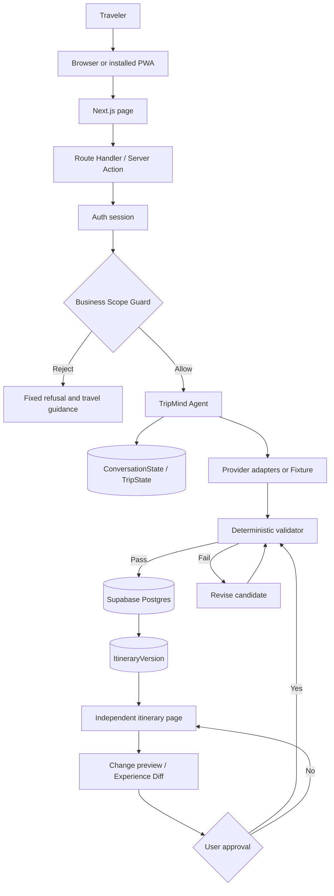

# TripMind Travel Planner — Implementation Plan

> Project type: Lifestyle Track / Planning an Escape — travel-planning AI Agent  
> Goal: Deliver a demonstrable and verifiable end-to-end journey within the hackathon, led by direct AI Chatbox planning. Plan, Harmony, Energy, replanning, and budget capabilities remain as secondary enhancements after the first itinerary is created.

## 1. Product Positioning

### 1.1 One-sentence positioning

TripMind is first an AI travel agent for people who have no plan yet. Users do not need to create a Plan or complete a long form. They can say a vague idea in the Chatbox; the Agent asks only for missing essentials such as destination and dates or trip length, then generates and saves an itinerary that can be edited later.

Beyond this shortest loop, TripMind continues to understand companions, budget, and real-world changes. It supports group coordination, itinerary approval, cost tracking, and disruption replanning. Harmony, Energy, Adapt, Discover, and budget features remain in scope, but they do not block first-time planning.

> **Don’t just plan the trip. Protect the experience.**

TripMind optimizes more than places and times. It protects group harmony, each traveler’s physical capacity, important experiences when circumstances change, and controlled space for spontaneous discovery:

> **Harmony → Energy → Adapt → Discover**

- **Harmony:** turn individual preferences into a fair and acceptable group plan.
- **Energy:** manage walking, activity density, transfers, and rest so the plan remains physically realistic.
- **Adapt:** repair the affected part of a trip after delays, weather, or cancellations instead of rebuilding everything.
- **Discover:** recommend controlled spontaneous experiences during a genuine free-time window.

### 1.2 Problems to solve

- Many users only know that they want to travel and do not know the destination, dates, or first step; traditional tools ask them to create a Plan and complete a long form first.
- Dates, accommodation, attractions, budgets, and group opinions are scattered across different tools.
- Group members have different interests, schedules, budgets, dietary needs, and physical limits.
- Ordinary AI itineraries can ignore opening hours, travel time, fixed arrangements, budget, buffers, and rest.
- When arrival times change, rain occurs, an attraction closes, or a member leaves early, users often have to rebuild the whole day manually.

### 1.3 Core differentiation

TripMind does not only generate attractive travel copy. It maintains a structured travel state and proposes feasible, explainable, and approvable options within constraints.

1. **Group Harmony:** aggregate preferences, expose conflicts, show overall and per-member satisfaction, and protect the least-satisfied member. Private budgets and sensitive preferences remain private.
2. **Travel Energy:** make walking, continuous activities, transfers, early starts, late finishes, rest, comfort targets, and fatigue risk visible during generation, optimization, and replanning.
3. **Constraint-aware itinerary:** use deterministic rules to validate time, distance, opening hours, budget, locked arrangements, and member limits; let the model explain and rank valid candidates.
4. **Disruption Replanner:** repair only the affected window, preserve locked experiences, and show a standardized Experience Diff before approval.

These capabilities are coordinated by one TripMind Agent through domain tools and deterministic services. They are not multiple independent agents with separate memories.

### 1.4 Hackathon success metrics

- A new user can open the Web App or installed PWA and talk to the Agent without first creating a Plan, inviting members, or completing a preference form.
- When destination or dates/trip length are missing, the Agent asks accurate follow-up questions and does not repeat known information.
- A user can go from a vague idea to a saved first itinerary in three minutes or less.
- Every itinerary supports solo use by default and can later invite members to the same trip.
- Four members can be summarized into shared preferences, conflicts, and voting items.
- Harmony shows overall score, every member’s satisfaction, and minimum satisfaction. An optimization must not sacrifice the minimum member score merely to improve the average.
- Daily pages show Travel Energy. In the demo, Energy optimization lowers walking or fatigue risk without violating hard constraints or removing key experiences.
- Every generated itinerary passes hard-constraint validation; costs and routes have a source or are clearly marked as estimates.
- A simulated disruption produces at least two candidate replans within ten seconds.
- Replanning preserves locked arrangements and shows Harmony, minimum satisfaction, budget, walking, fatigue risk, weather risk, retained experiences, and fixed-arrangement impact.
- Total budget, category budgets, estimated spend, and remaining headroom recalculate after changes.

## 2. Target Users

### 2.1 Primary user: the traveler with no plan

The user only has a desire to travel and does not know where to go, when to go, or how to structure the trip. TripMind must fill the minimum required information through natural conversation instead of requiring the user to understand the product model first.

### 2.2 Main usage: solo or small friend/family trips (1–8 people)

Every new trip is a complete solo trip by default. The creator can invite friends or family after an itinerary exists. Organizers can collect opinions, manage time and budget, and coordinate changes; members can provide genuine limits and participate in important decisions.

### 2.3 Secondary user: a traveler with known requirements

Users who already know their destination, dates, and constraints can ask the Agent to generate a plan or enter the optional manual Plan form. Plan is an advanced entry point, not a prerequisite for planning.

### 2.4 Representative personas

| User | Need | Main pain | TripMind value |
| --- | --- | --- | --- |
| Organizer Alex | Quickly form a plan everyone can accept | Chasing replies, editing spreadsheets, recalculating costs | Agent aggregates preferences, explains conflicts, and maintains versions |
| Budget-sensitive Jamie | Avoid overspending without exposing an exact limit | Cannot see what the whole plan will cost | Private budget range, category budgets, and overspend warnings |
| Mobility/dietary-sensitive Sam | A manageable and safe itinerary | “Everyone is fine” hides individual limits | Hard constraints first, with lower-load and alternative activities |
| Solo traveler Taylor | Save time and avoid trial and error | Too many search results are hard to combine | A usable schedule with buffers, estimates, and assumptions |

## 3. Key User Flows

### 3.1 Primary flow: direct AI Chatbox planning

1. **State the idea:** enter a natural-language request such as “I want to visit Japan, but I have no plan yet.”
2. **Extract known information:** capture destination, dates or duration, origin, party size, budget, interests, pace, and constraints without asking again.
3. **Clarify only blockers:** ask no more than one or two essential questions per turn. At minimum, confirm destination and dates or trip length. If the user says “you decide,” use clearly labeled defaults.
4. **Generate the first itinerary:** summarize the understanding, generate a basic validated day-by-day plan, and save it as the first itinerary version.
5. **Open an independent trip:** show a stable Trip ID, URL, timeline, movement, estimated cost, assumptions, and an Agent entry point. The result must not remain only in chat text.
6. **Continue editing:** requests such as “start Day 2 later” create a change preview. Significant changes require confirmation before a new version is written.
7. **Stay solo or collaborate:** the trip is complete for one person; the creator can later generate an invitation link.
8. **Use optional enhancements:** Harmony, Energy, budget, replanning, and Discover enrich an existing itinerary without blocking first generation.

### 3.2 Secondary enhancement flow

1. Add origin, currency, total budget, accommodation, arrival/departure time, fixed arrangements, and pace.
2. Invite members through a share link or code. Members provide interests, must-do items, avoidances, diet/accessibility needs, budget range, walking tolerance, early-start tolerance, rest preference, and privacy settings.
3. Aggregate preferences into consensus, majority preferences, minority must-haves, conflicts, and voting items. Calculate Harmony, per-member satisfaction, and minimum satisfaction.
4. Optimize the itinerary around accommodation, fixed arrangements, budget, and pace. Update timeline, route order, estimated cost, Energy, and assumptions.
5. Let members vote or react; let the organizer lock important arrangements. Major changes require a preview and approval.
6. Accept or simulate delays, weather, closures, cancellations, late arrivals, or reduced energy.
7. Replan the affected window, preserve locked items, and return candidates with Experience Diff, budget, walking, and fatigue risk.
8. Review total and category budgets, headroom, and member budget fit.
9. Optionally use `Surprise Me` for a 1–3 hour free window with Safe, Balanced, and Adventurous candidates.
10. Preserve the final itinerary, budget snapshot, and change record for export or sharing.

### 3.3 State model

Conversation state: `collecting → ready_to_generate → generating → itinerary_ready → refining`.

Trip state: `draft → collecting_preferences → planning → review → confirmed → in_trip → completed`.

Itinerary version state: `draft → proposed → approved → superseded`.

Activity state: `suggested / locked / confirmed / completed / cancelled`.

Conversation state drives clarification and first generation. After generation, `TripState` is the source of travel facts. A solo trip can enter `planning` without group onboarding or voting.

### 3.4 Experience principles

- Chatbox is the default Web App/PWA entry; the first screen must not require Plan creation.
- Ask only questions that block generation; label defaults clearly.
- Store the itinerary as an independent product object with a stable URL.
- Support complete solo use by default; invitations are optional.
- Keep raw private inputs private; share aggregated conclusions with the group.
- Separate Agent proposals from confirmed facts; never silently change a locked arrangement.
- Every replan explains what was retained, changed, why, how cost changed, and who is affected.
- Mark uncertain data as estimated or pending confirmation rather than pretending it is live fact.

### 3.5 Unified Demo Fixture and approval baseline

This is the single numerical and state baseline for the planning documents. `prototype-plan.md` defines the prototype scope and acceptance; `prototype.md` maps the same rules to screens and interactions. Neither should define a second set of budget, event, metric, or version rules.

| Item | Unified rule |
| --- | --- |
| Ordinary new user | Solo trip by default (1 person). Party size, diet, walking limits, and interests must come from input, not guessing. |
| Demo entry | The user explicitly selects `Load Penang Demo`; the `Demo Fixture preset` supplies Alex, Jamie, Sam, and Taylor, including Sam’s vegetarian/walking limits and Taylor’s shopping preference. |
| Trip scope | Three days in Penang; budget is RM4,800 for the whole group and full trip. |
| Locked arrangement | Day 2 dinner at 19:30; all candidates, optimizations, and replans must preserve it. |
| Rain event | Day 2 at 13:30; outdoor activities from 14:00–17:00 are affected. Candidates must recheck timing, cross-area travel, and buffers while preserving the 19:30 dinner. |
| Walking baseline | Day 2 starts at 8.4 km and zero rest blocks; the Energy candidate is 4.6 km and one rest block. Sam’s hard daily limit is 9.0 km and comfort target is ≤5.0 km. 8.4 km passes the hard constraint but may show `High` risk; `High` is not a violation. |
| Harmony | `72% → 91%` is a system estimate for a pending candidate. Formal Harmony becomes 91% only after the user approves the actual timeline change and validation passes. |
| Budget | Total limit RM4,800. Categories: accommodation RM1,900, food RM1,200, transport RM700, activities RM1,000. Current formal spend RM4,360, remaining RM440. Minimum-walking rain draft adds RM40: RM4,400 spend, RM400 remaining. |

Rain candidates must finish by 17:00, preserve at least 30 minutes of estimated transfer time, and retain a 60-minute dinner buffer. A candidate that cannot satisfy these rules is not approvable.

| Candidate | Category delta from current formal version | Estimated total | Remaining |
| --- | --- | ---: | ---: |
| Current formal version | Accommodation 1,800; food 1,040; transport 540; activities 980 | RM4,360 | RM440 |
| Minimum walking (recommended) | Transport +RM40 (540 → 580) | RM4,400 | RM400 |
| Preserve more interests | Transport +RM60 (540 → 600); activities +RM20 (980 → 1,000) | RM4,440 | RM360 |
| Lower budget | Transport -RM60 (540 → 480) | RM4,300 | RM500 |

Version 1 is the first validated formal itinerary. Each approved change increments the version from the current formal version; actions are not permanently tied to v2, v3, or v4. Harmony, Energy, and candidate calculations alone do not create a version. Approval of the actual activity/timeline change does.

## 4. TripMind AI Agent Design

### 4.1 Responsibilities

TripMind has one user-facing travel-state orchestrator. The following are logical responsibilities of the same Agent, not separate agents with separate memories:

- **Orchestrator:** recognize intent, read current state, call tools, and maintain context.
- **Requirement Clarifier:** extract requirements and ask for missing destination or dates/duration.
- **Preference Coordinator:** normalize tags, aggregate preferences, calculate Harmony, and form votes.
- **Energy Evaluator:** calculate daily/member Energy and suggest lower-load candidates.
- **Itinerary Planner:** generate candidate timelines under hard constraints and request validation.
- **Disruption Replanner:** identify impact, replace only unlocked activities, and create Experience Diff.
- **Budget Planner:** estimate cost, allocate categories, check limits, and compare candidates.
- **Serendipity Curator:** find feasible short-window experiences using location, budget, group preferences, and Energy.

### 4.2 Business Scope Guard

Every message first passes through a server-side `Business Scope Guard`. The model may have general knowledge, but product behavior is limited to TripMind travel planning. A system prompt alone is not sufficient protection.

Allowed scope: destination, dates/duration, itinerary generation and modification, routes and transport, budget, weather impact, group preferences, diet, mobility, Harmony, Energy, disruption replanning, Discover, and help using TripMind. Travel health, visa, and severe-weather questions receive planning-level cautions and official-source guidance, not diagnosis, legal conclusions, or safety guarantees.

Block code and implementation requests, homework, general knowledge, news or political commentary, generic copywriting, investment advice, unrelated medical or legal requests, ticketing, accommodation reservations, payments, and refunds. Use this fixed response:

> I only handle TripMind travel planning and itinerary management. Tell me your destination, dates, or how you want to change an existing itinerary.

```ts
type ScopeDecision = {
  status: "allowed" | "out_of_scope" | "unsafe";
  intent:
    | "plan_trip"
    | "clarify_requirements"
    | "modify_itinerary"
    | "trip_advice"
    | "tripmind_help"
    | "unknown";
  reasonCode:
    | "IN_SCOPE"
    | "MIXED_SCOPE"
    | "OUT_OF_SCOPE_GENERAL"
    | "OUT_OF_SCOPE_TRANSACTION"
    | "UNSAFE"
    | "UNKNOWN";
  allowedRequest: string | null;
  rejectedParts: string[];
};
```

- Only `allowed` with a known intent may call the Agent.
- Mixed requests pass only `allowedRequest`; the rejected part is explained briefly.
- Out-of-scope and unsafe requests do not call Agent/tools or change ConversationState, TripState, versions, budgets, or member state.
- Invalid schema, unknown intent, extra fields, or uncertain classification defaults to rejection.
- Agent output is checked again before it reaches the user.
- External place, route, weather, and pasted text are untrusted data and cannot change system rules or expand the tool set.

### 4.3 Structured state and memory

Before first generation, `ConversationState` contains at least `conversationId`, destination, date range, duration, origin, party size, budget, interests, pace, constraints, missing required fields, status, and generated `tripId`.

After generation, `TripState` contains destination, dates, currency, members, permissions, preferences, hard/soft constraints, Energy state, activity candidates, coordinates, durations, opening hours, prices, sources, accommodation, locked arrangements, Harmony snapshots, Experience Metrics, budgets, versions, votes, events, and Agent explanations.

The Agent reads structured state by phase rather than depending on an unbounded chat transcript.

### 4.4 Tool contracts

The model can use only structured TripMind tools, including:

`get_conversation_state`, `update_trip_requirements`, `get_trip_state`, `generate_itinerary`, `propose_itinerary_changes`, `apply_itinerary_changes`, `aggregate_preferences`, `calculate_harmony`, `calculate_energy_load`, `optimize_energy`, `search_options`, `estimate_route`, `validate_itinerary`, `calculate_budget`, `propose_replan`, `calculate_experience_diff`, `suggest_serendipity`, `create_vote`, `save_draft_version`, and `request_approval`.

Each tool returns `data`, `warnings`, `source`, and `updatedAt`. Errors include a readable explanation and fallback. Only explicit user approval can upgrade a draft to a formal version. Generic web search, code execution, arbitrary URLs, email, payment, and database-direct-write tools are not available.

### 4.5 Decision loop

1. Route Handler executes `Business Scope Guard`.
2. Reject unsafe, out-of-scope, unknown, or invalid requests without Agent/tool calls or state changes.
3. Pass allowed travel content to the Agent and parse a structured state/update intent.
4. Check missing destination or dates/duration before generating.
5. Read current state and locked items; distinguish hard and soft constraints.
6. Call the smallest intent-specific set of provider or fixture tools.
7. Filter candidates through deterministic validation.
8. Rank feasible options by minimum satisfaction protection, overall satisfaction, budget, Energy, risk, and retained experiences.
9. Save the first valid itinerary or produce two to three explained candidates for a complex change.
10. Show a preview for significant changes instead of silently applying them.
11. After output checks and approval, save the version and audit event.

### 4.6 Safety and reliability

- Separate prompts from tool results; external text cannot alter rules or read private preferences.
- Use structured fields for money, time, and places; the model cannot invent tool results.
- Apply strict schemas, an allow-list, and validator checks before writes.
- Log only minimal redacted scope and diagnostic fields; do not retain unnecessary private text.
- Give cautious planning guidance for health, visa, and severe-weather questions.
- Fall back to fixtures when an API is unavailable and label the data mode in the UI.

## 5. Group Preference Coordination and Group Harmony

### 5.1 Member input

Members can provide interests, must-do items, optional items, avoidances, dietary/accessibility needs, latest end time, walking tolerance, budget range, early-start tolerance, rest preference, and current `energyLevel` (`high / medium / low`). Each preference has strength: `must / prefer / neutral / avoid`.

### 5.2 Aggregation model

- Must-have and safety/accessibility limits default to hard constraints.
- Soft preferences become 0–5 weights.
- Results are grouped into full consensus, majority preferences, minority strong needs, conflicts, and unanswered items.
- Show budget bands to the group; keep exact ranges private.

Candidate ranking may use:

`score = preference satisfaction × member weight + group coverage + fairness bonus + retained-experience score - cost penalty - Energy penalty - risk penalty`.

Scores rank candidates only. A hard-constraint violation eliminates a candidate and cannot be offset by a high interest score.

### 5.3 Harmony view and minimum-satisfaction protection

The consensus view must show Overall Harmony, each Member Satisfaction, Minimum Satisfaction, ignored-member warnings, before/after comparison, budget change, and Energy change. Harmony is calculated by a deterministic service; the Agent explains it and proposes options.

Optimization order: satisfy hard constraints, protect minimum member satisfaction and key experiences, then improve the average and cost. Candidate scores must be labeled as system estimates. Real member feedback is stored separately and cannot be presented as an estimate.

### 5.4 Conflict resolution

When one member wants an activity and another explicitly avoids it:

1. Split participation and free-time options.
2. Find a lower-conflict alternative in the same area/time window.
3. Move the activity and give non-participants a clear opt-out.
4. If unresolved, create a vote that shows cost, walking, satisfaction, and affected members instead of only vote count.

## 6. Constraint-aware Itinerary

### 6.1 Hard constraints

- Do not overlap arrival/departure windows, accommodation windows, or locked arrangements.
- Respect opening hours and include buffers.
- Ensure travel between adjacent activities is feasible; cross-area movement is not free.
- Respect member availability, activity limits, continuous-activity limits, walking/physical limits, and necessary rest.
- Stay within total and member budget limits.
- Never ignore explicit dietary, safety, or accessibility requirements.

### 6.2 Soft constraints and optimization

Optimize interest coverage, fairness, budget headroom, variety, fewer transfers, weather fit, Energy, rest, and flexibility. The MVP uses transparent heuristic ranking rather than a global solver.

### 6.3 Itinerary output

Each activity shows start/end time, name, location, duration, travel method/time, estimated cost, compatible members, source, and confidence. Each day shows cost, movement time, walking, longest continuous activity, transfers, earliest start, latest end, rest blocks, Energy, and replaceable activities.

### 6.4 Deterministic validator

`validate_itinerary` checks overlaps, opening hours, route feasibility, budget, locked items, and member limits before a proposal is saved. It returns precise error locations and is the final gate; an LLM self-assessment is not sufficient.

## 7. Travel Energy

Travel Energy is as important as preferences and budget. It is calculated for each member and day during generation, optimization, and replanning.

### 7.1 Inputs and metrics

`calculate_energy_load` reads current energy level, walking limit, continuous-activity limit, early/late preferences, and rest preference, together with:

- Activity count and total activity time.
- Total walking, walking ratio, and longest walking segment.
- Continuous activity duration, buffers, and waiting.
- Transfers, cross-area movement, and transport complexity.
- Earliest start and latest end.
- Number, duration, and distribution of rest blocks.
- Activity type, weather exposure, slope, and accessibility where available.

Return `energyLoadScore`, `fatigueRisk` (`low / medium / high`), and per-member reasons. Missing data is estimated and labeled; it is not medical judgment.

### 7.2 Energy optimization

When load is high, propose local changes in this order:

1. Merge nearby activities and reduce cross-area travel.
2. Insert or extend rest blocks.
3. Replace with indoor, lower-walking, or simpler-transport experiences.
4. Shift start/end times to avoid very early or late schedules.
5. Split optional participation instead of violating a member’s hard constraint.

Show before/after activity count, walking, longest continuous activity, transfers, earliest start, latest end, rest blocks, member energy, fatigue risk, interest impact, budget impact, and locked-arrangement impact. Energy optimization must still pass the validator.

### 7.3 Acceptance

- Show daily Energy and per-member risk.
- Identify at least one low-energy or low-walking member’s protected limit.
- Demo Day 2 shows 8.4 km → 4.6 km, 0 → 1 rest block, and High → Medium risk.
- Provide at least one valid lower-load candidate.
- Do not introduce time, opening-hour, budget, locked-item, or member-limit violations.

## 8. Disruption Replanning

### 8.1 MVP events

Arrival or transit delay, rain or heat, attraction closure, restaurant/activity cancellation, late arrival or early departure, reduced member energy, and same-day budget overrun. Events can be user-entered or demo-triggered; real webhooks are optional.

### 8.2 Replanning algorithm

1. Normalize the event as `DisruptionEvent` with time, location, impact, and confidence.
2. Find affected activities and dependencies; freeze unaffected arrangements.
3. Protect `locked` and `confirmed` items. If a candidate affects a fixed arrangement, flag it and request human confirmation.
4. Search the remaining time window, preferring nearby, indoor, lower-movement, and time-flexible options.
5. Re-run hard-constraint and budget validation; return two or three candidates.
6. Calculate Experience Diff with moved, removed, added, retained, cost, risk, and affected-member details.
7. After approval, create a new version and keep the old version and event log for recovery.

### 8.3 Standard Experience Diff

Every candidate uses the same fields: Harmony, minimum satisfaction, budget, walking, fatigue risk, weather risk, retained key experiences, locked-arrangement impact, changed/removed/added activities, transfer/buffer changes, and the reason for each change.

### 8.4 Demo interaction

The Day 2 rain event affects 14:00–17:00 outdoor activities but preserves the 19:30 locked dinner. Candidates must end by 17:00 and leave the required travel and dinner buffers. Selection creates a pending draft; the formal itinerary remains unchanged until approval.

## 9. Budget Planning

### 9.1 Budget model

The budget includes currency, total limit, category limits, estimated total, estimated remaining, member budget-fit status, and per-activity cost. The demo categories are accommodation, food, transport, and activities.

### 9.2 Budget constraints

- Total and category limits may be soft or hard.
- Member budget ranges remain private; the group sees all fit, near-limit members, or overspend conflict.
- Generation, Energy optimization, and replanning recalculate cost and identify the activities that caused the change.
- Missing or stale prices are fixture/estimate values with a visible source and timestamp.

### 9.3 Budget output

The budget page shows category share, daily estimated spend, remaining budget, member fit, and candidate cost deltas. Users can change total or category limits and request a new plan. TripMind does not process payments, refunds, or post-trip accounting.

## 10. MVP Scope

### 10.1 Delivery priority

> **AI Chatbox clarification and generation > independent itinerary and conversational edits > solo/invite members > constraint validation > disruption replanning > Group Harmony > Travel Energy > budget planning > Serendipity**

Harmony, Energy, replanning, budget, and Serendipity remain in scope but must not block first generation.

### 10.2 Must Have — shortest loop

- AI Chatbox is the primary screen; no Plan creation first.
- Extract requirements and ask for missing destination or dates/duration.
- Do not repeat known information; label defaults.
- Generate and validate a 1–7 day first itinerary.
- Save it to an independent trip page and restore it after refresh/re-entry.
- Support natural-language edits, previews, confirmation, and version history.
- Support complete solo use and post-generation invitation links.
- Work with local fixtures without an API key.
- Deploy over HTTPS with a valid manifest and standalone PWA behavior on mobile and desktop.
- Keep build, deployment, migration, environment, provider/dependency, attribution, and AI-boundary evidence for submission.

### 10.3 Should Have — retained enhancements

- Manual rain/delay/cancellation events with local replanning, two or three candidates, Experience Diff, and approval.
- Harmony visualization with per-member satisfaction, minimum protection, ignored-member warning, and before/after comparison.
- Energy metrics and at least one validated lower-load candidate.
- Penang fixture with time, opening-hour, route, locked-item, member, and budget validation.
- Travel setup, budget, member invitations, private preferences, voting, conflicts, versions, locks, approvals, and diffs.
- `Surprise Me` for a 1–3 hour window with Safe, Balanced, and Adventurous options.
- Route visualization, live provider adapters, Markdown/CSV summary export, responsive loading/error recovery, and a low-priority internal Admin MVP.

### 10.4 Could Have

Multi-destination optimization, calendar sync, push notifications, and real-time member location or automatic lateness detection.

## 11. Web App/PWA Information Architecture

### 11.1 Pages and routes

| Route | Core content | Main actions |
| --- | --- | --- |
| `/` | AI Chatbox, examples, recent trips | State an idea, continue, load demo |
| `/chat/:conversationId` | Planning conversation, extracted requirements, clarification | Answer, accept defaults, generate |
| `/itineraries` | All trips created or joined by the user | Search, open, continue, start AI planning |
| `/trips/new` | Optional manual Plan form | Enter destination, dates, budget, members |
| `/trips/:tripId/onboarding` | Member preferences and constraints | Save preferences, invite members |
| `/trips/:tripId/consensus` | Harmony, member satisfaction, conflicts, votes | Optimize, vote, confirm priorities |
| `/trips/:tripId/itinerary` | Timeline, map, Energy, Agent conversation | Edit, invite, optimize, lock, approve |
| `/invite/:token` | Invitation summary and member identity | Join the trip |
| `/trips/:tripId/replan` | Event input, candidate comparison, Experience Diff | Trigger, compare, approve |
| `/trips/:tripId/budget` | Total/category budget, spend, fit | Adjust, compare, replan |
| `/admin` and `/admin/*` | Internal overview, users, trips, providers, system, audit | Restricted, recoverable administration |

### 11.2 Core components

Chatbox, suggestion prompts, missing-field notices, generation progress, Trip header, mobile bottom navigation, responsive desktop navigation, member permissions, invite button, preference cards, Harmony dashboard, member satisfaction cards, conflict/vote cards, itinerary timeline, Energy cards, lock markers, route map, budget progress, category table, event simulator, Experience Diff, `Surprise Me`, and Agent drawer.

### 11.3 Recommended architecture

Use one mobile-first Next.js + TypeScript project for pages, Route Handlers, Agent orchestration, and domain logic. Use Tailwind CSS and limited shadcn/ui. Planned production persistence is Supabase Auth + Postgres; provider access goes through `AIProvider`, Places, Directions, and Weather adapters; deploy to Vercel. Admin remains an internal feature in the same project.

The Agent, validator, permissions, invite tokens, formal TripState, versions, and third-party keys run on the server. The browser never calls AI or providers directly and never receives service-role secrets. The browser may use local persistence for the prototype; production truth belongs to Supabase Postgres.

### 11.4 Data flow



Ownership is fixed: `ConversationState` controls first-generation clarification; Supabase `TripState` is the travel source of truth after generation; each approved change writes a new `ItineraryVersion` and `TripEvent`. Invitations, permissions, and Admin actions are handled by APIs and domain services, not by the LLM.

## 12. MVP Data Model

| Entity | Key fields | Purpose |
| --- | --- | --- |
| `AgentConversation` | id, ownerId, tripId, state, missingRequiredFields, status, timestamps | Chatbox clarification and generation state |
| `AgentMessage` | conversationId, tripId, actor, scopeStatus, intent, reasonCode, promptVersion, tool metadata, response | Conversation, explanation, minimal scope audit |
| `Trip` | id, name, origin, destination, start/end, currency, budget, status, ownerId | Root trip state |
| `Member` | tripId, userId, name, role, privacy, status, energyLevel, walking/activity limits | Participant, permission, and physical boundaries |
| `TripInvite` | tripId, tokenHash, role, expiresAt, revokedAt, createdBy | Revocable expiring invitation |
| `PreferenceProfile` | memberId, interests, mustDo, avoid, constraints, budgetRange, weights, restPreference | Private member preferences |
| `ActivityOption` | title, location, coordinates, tags, duration, hours, price, indoor, weather, accessibility, source | Candidate activity and validation data |
| `ItineraryVersion` | tripId, version, status, reason, creator, Harmony/Energy snapshots, metrics | Auditable formal version |
| `ItineraryItem` | versionId, day, start/end, activityId, status, locked, cost, participants | Timeline item |
| `MemberDayState` | memberId, day, energy, availability, walking limit, notes | Day-level member constraints |
| `HarmonySnapshot` | versionId, overallScore, memberSatisfaction, minimumSatisfaction, warnings | Harmony comparison |
| `ExperienceMetric` | versionId, walking, activity count, transfers, rest, fatigue/weather risk, retained items, locked impact | Experience Diff metrics |
| `SerendipityCandidate` | tripId, window, location, duration, cost, tags, Energy, mode, source | `Surprise Me` candidate |
| `DisruptionEvent` | tripId, type, occurredAt, payload, severity, source | Replanning trigger |
| `Vote` | tripId, target, options, responses, deadline, status | Conflict decision |
| `BudgetPlan` | tripId, currency, limits, estimated total/remaining, member fit, updatedAt | Budget snapshot |
| `TripEvent` | tripId, type, payload, actor, createdAt | State-change and rollback history |
| `AdminUser` / `AdminAuditLog` | Controlled role and redacted action record | Restricted administration and audit |
| `AIProviderConfig` | provider, model, enabled/default/fallback, health | Non-secret provider configuration |

Use UUIDs. Store money as integer minor units or Decimal, never floating-point accumulation. Store time in UTC and display it in the destination timezone. Enable RLS with explicit grants and policies; keep private profiles private and expose controlled aggregation through server routes. Admin and provider secrets belong in a private schema and server environment only.

## 13. API and Integration Strategy

### 13.1 Internal API

- `POST /api/conversations` — create a planning conversation.
- `POST /api/conversations/:id/messages` — scope-check and process a message.
- `POST /api/conversations/:id/generate` — create the first trip and itinerary.
- `GET /api/itineraries` — list trips created or joined by the user.
- `POST /api/trips`, `GET /api/trips/:id` — create/read a trip.
- `POST /api/trips/:id/invites`, `POST /api/invites/:token/join` — invite and join.
- `PUT /api/trips/:id/preferences`, `POST /api/trips/:id/consensus` — preferences and aggregation.
- `POST /api/trips/:id/harmony/calculate` — Harmony and minimum satisfaction.
- `POST /api/trips/:id/itinerary/generate` — generate and validate a draft.
- `POST /api/trips/:id/energy/calculate`, `POST /api/trips/:id/energy/optimize` — Energy.
- `POST /api/trips/:id/itinerary/:version/approve` — approve a version.
- `POST /api/trips/:id/events` — create a disruption and replan proposal.
- `GET /api/trips/:id/replans/:replanId/experience-diff` — read a diff.
- `POST /api/trips/:id/replans/:replanId/approve` — approve a replan.
- `POST /api/trips/:id/serendipity` — return feasible `Surprise Me` options.
- `PUT/GET /api/trips/:id/budget`, `POST /api/trips/:id/budget/replan` — budget planning.
- `/api/admin/*` — overview, users, trips, invites, providers, system health, and audit logs for controlled Admin users.

All writes perform permission and idempotency checks and record events. Errors return readable `code`, `message`, and `details`. Shared request/response schemas live in `src/contracts`.

### 13.2 External adapters

Use `AIProvider`, `PlacesProvider`, `DirectionsProvider`, and optional `WeatherProvider` interfaces. Start with fixture data, then connect one real provider. Every adapter needs timeout, cache, retry, rate-limit, and fallback behavior. API keys are environment variables only. Prices are planning estimates, not inventory or transaction data.

### 13.3 Replaceable AI provider architecture

`AIProvider` exposes structured generation, optional streaming, health checks, capability declarations, and a unified error format. `ProviderRegistry` manages enabled/default/fallback providers, fixture mode, timeout, and retry policy. Agent, TripState, schemas, validator, Harmony, Energy, and Replan must not depend directly on vendor SDK types. MVP needs one real provider at most; fixture mode must complete the core demo without a key or network.

## 14. Competition and Compliance Strategy

### 14.1 Deployability

Deliver a mobile-first Web App/PWA with Next.js, TypeScript, Tailwind, limited shadcn/ui, and Vercel HTTPS. Validate build, routes, PWA manifest, home-screen installation, standalone launch, refresh recovery, invite URLs, and the complete core flow on at least one phone and one desktop browser.

### 14.2 Services, APIs, and dependencies

Choose free-tier or demo-trial services where possible. Maintain a provider/dependency register with source URL, version, owner, license, use, limits, key variable name, cost risk, fallback, and replacement option. Never record actual secrets. Test keyless and network-failure fallback before submission.

### 14.3 AI explainability and team understanding

Submission materials must explain that the LLM handles intent, clarification, candidate orchestration, explanation, and tool selection. Deterministic services own TripState facts, money/route calculations, validator gates, Harmony, Energy, Replan, permissions, and approval. The team must be able to walk through a request from scope check to tool calls, validation, approval, version, and event.

### 14.4 Originality and attribution

Record boilerplate, templates, libraries, AI-generated code, source URLs, versions/commits, licenses, and changes. The team must implement the core Harmony, Energy, constraint, Experience Diff, local Replan, and budget logic during the hackathon. Do not present an existing personal project’s core business logic as new work.

### 14.5 Accessibility and device baseline

Use semantic HTML, accessible names, keyboard focus, form errors, clear touch targets, basic contrast, and text/icons in addition to color. Test mobile/desktop, zoom, orientation, browser back, stable URLs, refresh recovery, PWA installation, and standalone launch. This is a hackathon quality baseline, not a full WCAG audit.

### 14.6 Team and environment workflow

Use feature branches and Pull Requests in one Git repository. Database changes go through `supabase/migrations`; do not edit production tables only in a dashboard. Separate local, shared development, preview, and production environments. Commit a lockfile, compatible Node version, `.env.example`, and schema/API changes in the PR description.

## 15. Implementation Phases

### Phase 0 — Scope and scaffolding (0.5 day)

Set up the Next.js project, tokens, App Shell, manifest, icons, fixture/store, `Business Scope Guard`, contracts, and validation/test skeleton.

### Phase 1 — AI Chatbox and first itinerary (1 day, highest priority)

Build the home Chatbox, clarification flow, structured condition review, generation progress, validator, independent itinerary page, persistence boundary, and Version 1.

### Phase 2 — Constraints, locks, and disruption foundation (0.75 day)

Implement locked dinner protection, the Day 2 rain fixture, time/route/buffer validation, candidate costs, draft expiry, `baseVersion`, idempotent approval, and Experience Diff.

### Phase 3 — Solo/collaborative input and Harmony (0.5–1 day)

Keep solo use complete, add invitation UI and private preferences, aggregate conflicts, show Harmony and minimum satisfaction, and require approval for actual changes.

### Phase 4 — Energy and budget (1–1.5 days)

Add Energy metrics and lower-load candidates, budget page, category deltas, member fit, version comparison, and approval from the current formal version.

### Phase 5 — Validation and presentation (0.5–1 day)

Test mobile, desktop, keyboard, zoom, direct routes, refresh, PWA, deployment, fixture fallback, public links, screenshots, captions, README, competitive positioning, ideation board, mentor feedback, and usability tasks.

Priority remains: **Business Scope Guard > lock/version approval and rain foundation > Chatbox generation > itinerary edits > solo/invite > Harmony > Energy > budget > Serendipity**. Admin is lower priority and cannot reduce core-flow quality.

## 16. Acceptance Criteria

### 16.1 Functional acceptance

- In-scope planning, modification, budget, weather, member, Harmony, Energy, and TripMind-help requests reach the correct flow.
- Code, homework, marketing, news/politics, investment, unrelated health/legal, and transaction requests are rejected before Agent/tool calls with `toolCalls=[]` and `stateChanged=false`.
- Mixed requests pass only the travel portion to the Agent.
- A new user starts in Chatbox, receives only necessary questions, and gets a saved first itinerary within three minutes.
- The itinerary has an independent record and stable URL; refresh and re-entry recover it.
- A natural-language change shows a preview and creates a new version only after confirmation.
- Solo users can complete the core journey; invitations join members to the same trip.
- Private member preferences are stored without exposing exact private budget or raw notes to the group.
- Harmony shows overall, per-member, minimum satisfaction, ignored-member warning, and before/after reasons.
- Energy shows activities, walking, continuous activity, transfers, early/late times, rest, energy level, and fatigue risk.
- Validator prevents hard-constraint violations from becoming formal.
- Locked arrangements remain unchanged unless explicitly unlocked and confirmed.
- Rain replan identifies Day 2 14:00–17:00, preserves the 19:30 dinner, returns at least two valid candidates, and shows the complete Experience Diff.
- Approval creates a new version while the old version and change reason remain viewable.
- Budget correctly shows RM4,800 limit, RM4,360 current spend/RM440 remaining, and the RM40 rain draft at RM4,400/RM400 remaining.
- Admin routes are restricted to active `AdminUser` identities; administrative changes are recoverable and audited.

### 16.2 Quality acceptance

- Scope Guard tests cover English, Chinese, Bahasa Melayu, typos, mixed requests, and prompt-injection attempts.
- Out-of-scope examples are rejected before Agent/tool calls; normal travel requests reach the correct intent.
- State before and after rejected requests is identical; logs contain only minimal redacted scope data.
- Fixture mode completes the core flow without API keys and survives network failure/timeouts.
- All keys stay in environment variables and never appear in repository, logs, bundles, screenshots, or recordings.
- Validator, budget, Harmony, Energy, and replan analysis have automated tests.
- Core pages work at target phone and desktop sizes, zoom, orientation, loading, empty, timeout, and no-result states.
- Keyboard, labels, focus, screen-reader smoke checks, touch targets, browser back, refresh recovery, and non-color status expression pass.
- Estimates are not presented as live facts and major changes cannot bypass approval.
- Three to five people not involved in implementation complete task-based testing; failures and fixes are recorded.
- The team can explain the LLM/deterministic boundary and the key algorithms.
- Provider, dependency, license, attribution, and fallback records are complete and demo data contains no real sensitive information.

## 17. Demo Script (approximately 5–6 minutes)

Demo trip: after showing an ordinary solo user, explicitly load the Penang `Demo Fixture preset` for four friends, three days, and RM4,800. The group shares food and culture interests; one member is vegetarian, one has a walking limit, and one wants shopping time.

### 17.1 Core path (approximately 2 minutes)

1. Enter “I want to travel, but I do not have a plan yet.”
2. Show Agent questions for destination and dates/duration.
3. Explain that ordinary users default to one person, then load the Penang Demo preset.
4. Generate and save the first itinerary with estimates and assumptions.
5. Say “Start Day 2 later,” inspect the change preview, and approve it.
6. Show that the trip works solo, then open the invite link.
7. Point out that Plan is a secondary entry point and does not block Chatbox planning.

### 17.2 Enhancement path (approximately 3–4 minutes)

1. Open Harmony and show estimated 72% → 91%, per-member satisfaction, minimum protection, and activity reasons.
2. Approve the actual Harmony activity change and show the next version.
3. Open Energy and show Day 2 walking 8.4 km → 4.6 km, rest 0 → 1, and fatigue High → Medium.
4. Trigger rain at 13:30; show the affected window, unchanged 19:30 dinner, buffers, three candidates, and Experience Diff.
5. Approve minimum walking and show RM4,360 → RM4,400 plus the new version.
6. If time allows, use `Surprise Me` in a one-hour window and switch Safe/Balanced/Adventurous.
7. End on version history: first itinerary → approved edits → Harmony → Energy → rain replan, with version numbers generated from the current formal version.

## 18. Risks and Mitigation

| Risk | Impact | Mitigation |
| --- | --- | --- |
| LLM suggests closed, over-time, or over-budget activities | Lost trust | Structured output, validator gate, fixture fallback |
| User or external data pushes Agent outside TripMind | Scope breach or state pollution | Scope checks before/after Agent, strict schema, narrow tool allow-list, injection tests |
| API key, rate limit, or network failure | Demo interruption | Adapters, cache, timeout, retry, fixture fallback |
| Member conflict cannot be solved automatically | Poor group experience | Private preferences, weights, split activities, voting, approval |
| Replan changes a fixed arrangement | Trust failure | Locked state, versioning, explicit confirmation |
| Estimate is mistaken for a quote | User misled | Source, timestamp, estimate label, no transactions |
| Over-planning causes fatigue | User rejects plan | Daily limits, buffers, free time, pace options |
| PWA or deployment mismatch | Cannot install or open | Manifest/HTTPS checks on mobile and desktop |
| Environment or database mismatch | Broken deployment | Lock versions, migrations, separated environments, Preview smoke test |
| Incomplete secrets/licenses/attribution | Security or compliance issue | Environment injection, register, history/build-asset checks |
| Team cannot explain AI decisions | Review distrust | Fixed Agent/deterministic boundary and walkthrough |
| Admin authorization error | Unauthorized or harmful action | Latest Auth identity, controlled `AdminUser`, RLS/grants, recoverable actions, audit log |
| Single-provider lock-in/failure | Switching cost or outage | `AIProvider`, `ProviderRegistry`, adapters, one live provider plus fixture fallback |

## 19. Explicitly Out of Scope for This MVP

- Ticketing, accommodation booking, inventory, payments, refunds, or settlement.
- Absolute accuracy guarantees for prices, routes, weather, or activity availability.
- Visa, medical, insurance, and severe-weather safety guarantees.
- Enterprise travel approval, loyalty systems, real-time multi-cursor collaboration, or real-time location tracking.
- Complex global optimization, multi-destination solving, or automatic reading of all group-chat history.
- Default exposure of exact member budgets, diet, health, or sensitive constraints.
- Treating the LLM as the sole authority for money, time feasibility, permissions, or writes.
- Turning TripMind into a general chat, coding, homework, news, political, writing, investment, medical, or legal assistant.
- A separate Admin application, complex RBAC editor, finance/support back office, direct SQL, or direct database editing.
- Permanent deletion of users or trips; displaying or editing provider API keys.
- Native Android/iOS apps, tablet-specific native UI, Wear OS, or other native platforms.
- Putting the Agent, formal collaboration state, member permissions, or server keys in the browser bundle/service worker.
- Offline itinerary editing, background sync, push notifications, or caching private/authorized API responses in the service worker.
- A full WCAG audit; deliver the core accessibility baseline defined above.
- Reusing another personal project’s core business logic as if it were hackathon work; all sources and licenses must be recorded.

## 20. Definition of Done

The core MVP is complete when a traveler with no plan can open TripMind over HTTPS or launch the PWA from the phone home screen, start in Chatbox, pass `Business Scope Guard`, answer a small number of destination/date questions, receive a saved itinerary, reopen it through a stable URL, and continue editing it. The trip works fully for one person and can later invite members without first creating the old Plan form.

The enhancement definition is also satisfied when a reviewer can load the preset, run Harmony, Energy, rain replanning, Experience Diff, approval, and budget review; locked arrangements remain protected; hard constraints pass; estimates are labeled; fixture fallback works without keys or network; and all approved changes are recoverable through version history.

Submission evidence must include PWA installation and standalone checks, Vercel/Supabase deployment and health checks, migration and environment verification, provider/dependency/license/attribution records, Git evidence of original work, AI walkthrough, and accessibility/device smoke checks. If Admin is implemented, ordinary users must be rejected, Admin actions must be recoverable and audited, and provider keys must never be exposed.
