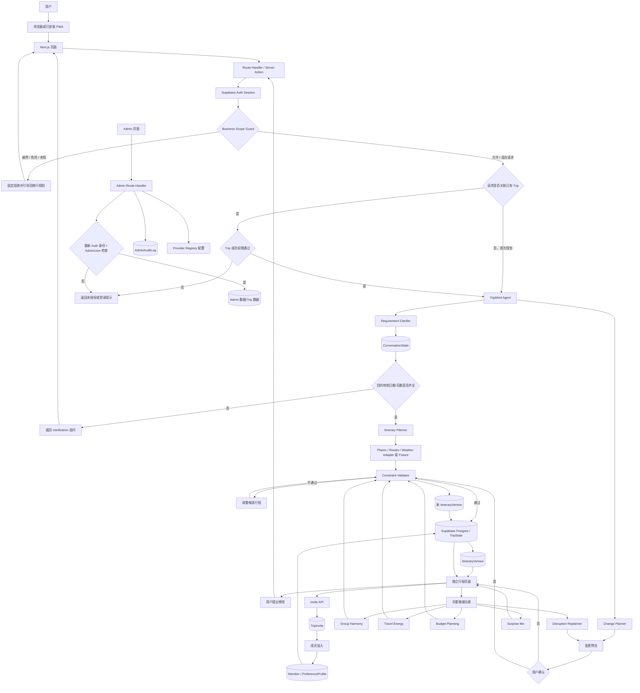

# TripMind Travel Planner 实施计划

> 项目类型：Lifestyle Track / Planning an Escape  旅行规划 AI Agent  
> 目标：以 AI Chatbox 直接规划为主线，在黑客松时间内交付一条可演示、可验证的端到端用户旅程；原有 Plan、Harmony、Energy、重排和预算能力保留为次要增强功能。

## 1. 产品定位

### 1.1 一句话定位

TripMind 首先是一个面向“没有任何计划”用户的对话式旅行 AI Agent。用户不需要先创建 Plan 或填写完整表单，只要在 Chatbox 说出模糊想法；Agent 会主动补问目的地、日期/天数等缺失信息，生成并保存一份可继续修改的行程。

在这个最短闭环之外，TripMind 仍持续理解同行者、预算与现实变化，并负责群组协调、行程确认、费用记录和突发事件重排。原计划中的 Harmony、Energy、Adapt、Discover 与预算能力全部保留，但作为行程生成后的次要增强功能，不阻塞首次规划。

> **Don’t just plan the trip. Protect the experience.**

TripMind 的优化对象不只是地点和时间，还包括同行者之间的和谐度、每个人的体力、现实变化下的关键体验，以及临时探索的空间。产品体验围绕四个连续环节展开：

> **Harmony → Energy → Adapt → Discover**

- **Harmony**：把个人偏好协调成公平、可接受的群组方案。
- **Energy**：控制步行、活动密度、换乘和休息，避免计划压垮成员。
- **Adapt**：发生延误、天气或取消时，局部修复而不是推翻整趟旅行。
- **Discover**：在有空闲时间时，根据当下状态提供可控的临时探索。

### 1.2 要解决的问题

- 很多用户只有“我想去旅行”的模糊念头，不知道目的地、日期或该从哪里开始；传统工具却先要求创建 Plan 和填写长表单。
- 日期、住宿地点、想去的景点、预算和群聊意见分散在多个工具中。
- 组团旅行中，每个人的兴趣、时间、预算和体力不同，组织者需要手动协调。
- 普通 AI 行程常忽略营业时间、路程、固定安排、预算和休息等硬约束。
- 到达时间变化、下雨、景点关闭或成员临时退出后，用户通常只能手动重做整天计划。

### 1.3 核心差异

TripMind 的核心不是“生成一段好看的旅游文案”，而是维护一份结构化的旅行状态，并在约束内主动提出可执行、可解释、可审批的方案。

四个产品能力：

1. **Group Harmony**：以 Group Preference Engine 为基础，把个人偏好转成群组共识、冲突和投票项，并以整体 Harmony、个人满意度和最低成员满意度保护来衡量公平性；同时保护成员的私密预算和敏感偏好。
2. **Travel Energy**：把活动密度、步行、连续活动、换乘、早起/晚归和休息块纳入可解释的体力负荷评估，避免平均满意度掩盖某位成员无法承受的行程。
3. **Constraint-aware Itinerary**：用确定性的规则校验时间、距离、营业时间、预算、用户锁定安排和成员限制，再由模型解释和排序候选方案。
4. **Disruption Replanner**：发生变化时只重排受影响部分，尽量保留用户锁定的关键安排，并以标准 Experience Diff 清楚显示变更、代价和取舍。

这些能力由一个 TripMind Agent 编排，通过领域工具调用确定性计算和数据适配器；它们不是多个彼此独立的真实 Agent。

### 1.4 产品成功指标（黑客松版）

- 新用户打开 TripMind Web App 或已安装的 PWA 后即可直接和 Agent 对话，无需先创建 Plan、邀请成员或完成偏好表单。
- 当目的地、日期/天数等必要信息缺失时，Agent 能准确追问；信息齐全后不重复提问。
- 用户可以在 3 分钟内从模糊想法得到一份已保存、可再次打开的首版行程。
- 每份行程默认支持单人使用，也可以在生成后邀请成员加入同一行程。
- 从创建旅行到看到首版可执行行程不超过 3 分钟。
- 4 名成员的偏好能被汇总为共同偏好、冲突和待投票事项。
- 共识页显示整体 Harmony Score、每位成员满意度和最低满意度；优化后整体分数提升，且最低成员满意度不得因追求平均分而下降。
- 每日行程显示 Travel Energy 指标；在演示场景中，Energy 优化能降低步行或疲劳风险，同时不违反硬约束并保留关键体验。
- 生成的行程 100% 通过硬约束校验，所有费用和路程都有来源或明确标为估算。
- 模拟突发事件后 10 秒内给出至少 2 个候选重排方案。
- 重排保留已锁定安排，并展示完整 Experience Diff：Harmony、最低满意度、预算、步行、疲劳风险、天气风险、关键体验保留情况和固定安排影响。
- 总预算、分类预算、预计花费和剩余预算能够随行程调整而重新计算。

## 2. 目标用户

### 2.1 首要用户：没有任何计划的旅行者

用户只有“想去旅行”的念头，不知道该去哪里、何时去或怎样安排。TripMind 必须用自然对话帮助用户补齐必要信息，而不是要求用户理解产品结构或先填写 Plan。

### 2.2 主要使用形态：个人或小型朋友/家庭旅行（1–8 人）

每份新行程默认是个人行程，可以从头到尾单独使用。用户也可以在行程生成后的任何时间邀请朋友或家人；典型旅行组织者仍可收集意见、整理时间、控制预算和协调修改，其他成员可以表达真实限制并参与关键决策。

### 2.3 次要用户：有明确需求或偏好手动规划的旅行者

已经知道目的地、日期和详细条件的用户可以直接让 Agent 生成，也可以进入原有 Plan 手动填写更多字段。Plan 是可选的高级入口，不是开始规划的前置条件。

### 2.4 典型人物画像

| 用户 | 需求 | 主要痛点 | TripMind 价值 |
| --- | --- | --- | --- |
| 组织者 Alex | 快速形成大家都接受的方案 | 在群聊里追问、改表格、重新算钱 | TripMind Agent 汇总偏好、解释冲突、维护版本 |
| 预算敏感的 Jamie | 不想超支，也不想公开具体上限 | 不知道当前计划最终会花多少钱 | 私密预算区间、分类预算和方案超支预警 |
| 体力/饮食有特殊要求的 Sam | 行程可承受、饮食安全 | “大家都可以”掩盖了个人限制 | 硬约束优先，生成替代路线和自由活动 |
| 独旅 Taylor | 省时间、少踩坑 | 搜索结果多但难以组合 | 直接得到带缓冲和预算的可执行日程 |

## 3. 关键用户流程

### 3.1 主流程：AI Chatbox 直接规划

1. **说出想法**：用户打开 TripMind Web App 或已安装的 PWA，直接在 AI 规划首页的 Chatbox 输入自然语言，例如“我想去日本，但还没有任何计划”。
2. **提取已知信息**：Agent 从对话中提取目的地、日期/天数、出发地、人数、预算、兴趣、节奏和限制，不重复询问用户已经提供的内容。
3. **主动补问**：若生成首版行程所需的信息不足，Agent 每轮最多追问 1–2 个关键问题；至少确认目的地，以及日期范围或旅行天数。用户回答“你决定”时，Agent 使用明确标注的合理默认值继续。
4. **生成首版行程**：必要信息齐全后，Agent 简短复述理解，生成经过基础约束校验的按天行程，并自动保存为旅行的首个行程版本。
5. **进入行程页面**：生成结果不是一次性聊天文本；系统进入独立行程页面，并以稳定的行程 ID 和可分享 URL 标识，在专门页面显示日期、每日时间线、地点、移动、费用估算、假设和继续对话入口。
6. **继续修改**：用户可以在行程页说“第二天不要太早”或“把博物馆换成逛街”。Agent 给出变更预览，重大修改经确认后创建新版本。
7. **个人或协作**：行程默认只有创建者一人且功能完整；用户可以之后点击“邀请成员”生成链接，成员加入同一行程并提出偏好或修改建议。
8. **使用增强能力（可选）**：用户按需进入 Harmony、Energy、预算、重排和 Discover；这些能力增强已有行程，但不阻塞首次生成。

### 3.2 次要增强流程（保留原计划能力）

1. **完善旅行资料**：在已有行程上补充出发地、币种、总预算、住宿地点、到达/离开时间、固定安排和旅行节奏；也可以从次级 Plan 入口手动创建。
2. **邀请成员**：生成分享链接或邀请码。每位成员填写自己的兴趣、必做、避免、预算区间、饮食、体力、可用时间和隐私选项。
3. **形成共识**：TripMind Agent 去重偏好、识别硬冲突，展示“共同喜欢”“有人强烈想做”“可分组进行”“需要投票”四类结果，并计算整体 Harmony、个人满意度和最低成员满意度。
4. **优化行程**：TripMind Agent 根据住宿、固定安排、预算和旅行节奏更新按天时间线、地图顺序、预计费用、Energy 指标和假设。
5. **协作确认**：成员对活动点赞/投票；组织者锁定安排。所有重大改动显示差异并需要审批。
6. **旅行中维护**：成员可标记迟到、计划取消或身体不适；系统可接收或模拟天气、到达延误和景点关闭事件。
7. **局部重排**：Agent 找出受影响活动，保留已锁定安排，给出带 Experience Diff、预算、步行量和疲劳风险的候选方案；成员或组织者批准后生成新版本。
8. **预算复核**：查看行程预计总花费、分类预算、成员预算适配度和不同方案的成本差异。
9. **临时探索（可选）**：出现 1–3 小时空闲时，使用 Surprise Me 按 Safe、Balanced、Adventurous 三档推荐附近体验。
10. **结束总结**：保留最终行程、预算快照和变更记录，支持导出分享。

### 3.3 关键状态

对话状态：`collecting → ready_to_generate → generating → itinerary_ready → refining`。
旅行状态：`draft → collecting_preferences → planning → review → confirmed → in_trip → completed`。  
行程版本状态：`draft → proposed → approved → superseded`。  
活动状态：`suggested / locked / confirmed / completed / cancelled`。

其中对话状态负责 Chatbox 的补问与生成闭环；旅行状态负责生成后的协作与增强能力。个人行程不需要经过 `collecting_preferences` 或群组投票即可进入 `planning`。

### 3.4 体验原则

- Chatbox 是 Web App/PWA 的默认启动入口；首屏不能先要求用户填写 Plan。
- Agent 只追问会阻止生成的问题，每轮最多 1–2 个；预算、兴趣、节奏等可选信息缺失时使用清楚标注的默认值。
- 行程必须保存为独立产品对象，并可通过站内导航和稳定 URL 重新打开，不能只存在于聊天回复中。
- 行程默认支持单人使用；邀请成员是生成后的可选动作。
- 私密输入默认只对本人和 Agent 可见；公开给群组的是聚合结论，不是个人原话或精确预算。
- Agent 提案与已确认事实分开显示，不能悄悄修改用户锁定的固定安排。
- 每次重排都给出“保留了什么、改变了什么、为什么、预算差多少、谁会受影响”。
- 遇到不确定数据时明确标注“估算/待确认”，不伪装成实时事实。

### 3.5 统一 Demo Fixture 与审批口径

本节是三份规划文档共用的数值和状态基线。`prototype-plan.md` 只定义本阶段范围与验收，`prototype.md` 只把本节规则映射到画面和交互；两者不得另行定义预算、指标、事件日期或版本规则。

| 项目 | 统一口径 |
| --- | --- |
| 普通新用户 | 默认单人行程（1 人）；人数、饮食、步行限制和兴趣必须来自用户输入，不得由系统猜测 |
| Demo 入口 | 用户主动点击“加载槟城 Demo”后载入 `Demo Fixture preset`；Alex、Jamie、Sam、Taylor 共 4 人以及 Sam 的素食/步行限制、Taylor 的购物偏好均标为演示预设来源 |
| 行程范围 | 槟城 3 天；预算为全组 4 人、全程 3 天的总预算 |
| 锁定安排 | Day 2 19:30 晚餐，所有候选、优化和重排都必须保留 |
| 暴雨事件 | Demo 事件发生在 Day 2 13:30，影响原定 14:00–17:00 的户外活动；候选必须在事件后重新校验活动时间、跨区交通和缓冲，并保留同日 19:30 晚餐 |
| 步行基准 | Day 2 初始预计步行 8.4 km、休息块 0；Energy 候选为 4.6 km、休息块 1。Sam 的 Demo Fixture 每日硬上限为 9.0 km，舒适目标为 ≤5.0 km；8.4 km 通过硬约束但可产生 `High` 风险，`High` 不等于违规 |
| Harmony | `72% → 91%` 是待批准候选的系统估算偏好匹配度；显示活动调整原因。只有用户批准实际时间线变化并通过校验后，正式 Harmony 才更新为 91% 并创建新版本 |
| 预算 | 全组/全程总上限 RM4,800；分类预算为住宿 RM1,900、餐饮 RM1,200、交通 RM700、活动 RM1,000，合计 RM4,800。当前正式版本预计花费 RM4,360（1,800 + 1,040 + 540 + 980），剩余 RM440；暴雨“最少步行”草稿相对当前正式版本增加 RM40，预计 RM4,400，剩余 RM400 |

步行数值是行程负荷的 Demo 估算，不是医疗建议；成员真实反馈只在成员主动提交后显示，并与系统估算分开展示。暴雨候选需在 Day 2 17:00 前结束替代活动，预留至少 30 分钟到晚餐地点的预计交通和 60 分钟缓冲；若无法满足，则候选不可批准。

版本和草稿遵循以下通用规则：首版生成并通过硬约束校验后为当前正式 Version 1；任何实际变更都以批准时的 `currentVersion` 为基准，批准成功后递增一个版本号，不能把某个动作永久绑定为 v2/v3/v4。Harmony 运行本身只产生系统估算候选；批准其实际活动调整时才创建下一版本。标准 8 屏演示若依次批准 Screen 4 的“第二天不要太早”、Harmony、Energy、暴雨，会呈现 Version 1 → 2 → 3 → 4 → 5；跳过或取消任一变更时，后续编号按实际批准次数顺延。

暴雨候选的分类增量和总额必须同时可核对：

| 候选 | 分类增量（相对当前正式版本） | 预计总花费 | 剩余 |
| --- | --- | ---: | ---: |
| 当前正式版本 | 住宿 1,800；餐饮 1,040；交通 540；活动 980 | RM4,360 | RM440 |
| 最少步行（推荐） | 交通 +RM40（540 → 580） | RM4,400 | RM400 |
| 保留更多兴趣 | 交通 +RM60（540 → 600）；活动 +RM20（980 → 1,000） | RM4,440 | RM360 |
| 更省预算 | 交通 -RM60（540 → 480） | RM4,300 | RM500 |

上述分类均不超过各自 RM1,900 / RM1,200 / RM700 / RM1,000 上限；+RM40 是相对当前正式版本的增量基准，不是把活动花费直接加到活动分类上。每个待批准草稿保存 `baseVersion`、候选内容、原因、创建时间和过期时间。批准前若当前正式版本已变化或草稿过期，必须要求从当前版本重新生成；重复点击批准使用幂等结果，不创建重复版本。跳过某一演示步骤或可选能力只推进 `demoStep`，不改变正式版本；取消草稿只关闭候选，也不改变正式版本；刷新、浏览器返回和直接打开子路由都从持久化状态恢复当前正式版本、待批准草稿和历史；`Reset Demo` 清除草稿与历史并回到初始单人/或重新加载 Demo 的入口状态。

标准演示中，晚起修改、Harmony 实际调整和 Energy 实际调整若未改变费用，Version 1–4 都沿用 RM4,360 基准；暴雨候选在批准前显示 RM4,360 → RM4,400，批准后对应的新正式版本沿用 RM4,400。任何真实活动变更导致分类金额变化时，必须从批准时的当前版本重新计算并展示新的分类增量，不能继续沿用旧的 +RM40。

## 4. TripMind AI Agent 设计

### 4.1 职责边界

TripMind Agent 是唯一面向用户的旅行状态编排者，负责理解自然语言、调用领域工具、组织候选方案、解释取舍和请求审批。产品只规划与调整旅行，不承担任何交易或预订职责，也不作为通用聊天、写作、编程、作业、新闻、政治、投资、医疗或法律助手。以下是同一个 Agent 的逻辑职责边界，不应实现为多个彼此独立、各自维护记忆的真实 Agent：

- **Orchestrator**：识别用户意图，读取最新旅行状态，安排工具调用并维护对话上下文。
- **Requirement Clarifier**：从自然语言提取旅行需求，维护缺失字段列表；目的地和日期/天数不完整时追问，齐全后触发行程生成。
- **Preference Coordinator**：规范化标签、聚合偏好、计算 Group Harmony、冲突/共识和投票项。
- **Energy Evaluator**：计算成员和每日行程的 Travel Energy、疲劳风险，并提出降低负荷的候选调整。
- **Itinerary Planner**：依据硬约束生成候选时间线，并请求确定性校验器验证。
- **Disruption Replanner**：分析事件影响范围，对未锁定部分做局部替换和排序，生成 Experience Diff。
- **Budget Planner**：估算行程成本、分配分类预算、检查成员预算边界并比较候选方案。
- **Serendipity Curator**：在明确的短空闲时间内，根据当前位置、预算、群组偏好和 Energy 状态筛选临时体验。

### 4.2 Business Scope Guard（业务范围门卫）

所有用户消息必须先经过服务器端 `Business Scope Guard`，通过后才允许进入 TripMind Agent。底层模型可以具备通用知识，但产品行为严格限制在 TripMind 旅行规划全流程内；不能只依赖一句 system prompt 实现边界。

允许范围固定为：目的地选择、日期/天数、行程生成与修改、路线交通、预算费用、天气对行程的影响、同行偏好、饮食与体力限制、Harmony、Energy、突发重排、Discover，以及 TripMind 功能使用帮助。简单问候可以礼貌回应一句，但必须立即引导用户提供目的地、日期或行程修改需求，不继续闲聊。旅行医疗、签证和极端天气问题只提供规划层面的风险提醒与官方信息建议，不作诊断、法律结论或安全保证。

以下请求必须拦截：代码和技术实现、作业和通用知识题、新闻或政治评论、通用写作或营销文案、投资建议、与旅行无关的医疗或法律咨询，以及购票、住宿预订、付款、退款等交易操作。统一越界回复为：

> 我只负责 TripMind 的旅行规划与行程管理。你可以告诉我目的地、日期，或者想怎样修改现有行程。

范围判断使用严格结构化契约：

```ts
type ScopeDecision = {
  status: "allowed" | "out_of_scope" | "unsafe";
  intent:
    | "plan_trip"
    | "clarify_requirements"
    | "modify_itinerary"
    | "trip_advice"
    | "tripmind_help"
    | "unknown";
  reasonCode:
    | "IN_SCOPE"
    | "MIXED_SCOPE"
    | "OUT_OF_SCOPE_GENERAL"
    | "OUT_OF_SCOPE_TRANSACTION"
    | "UNSAFE"
    | "UNKNOWN";
  allowedRequest: string | null;
  rejectedParts: string[];
};
```

- `status = allowed` 且 `intent != unknown` 时才能调用 Agent；`unknown`、schema 不合法、出现额外字段或分类失败时默认按越界处理。
- 混合请求只把旅行部分规范化到 `allowedRequest` 后交给 Agent，并简短说明其他部分不在 TripMind 范围。例如“规划槟城三天并写 Python”只处理槟城行程。
- `out_of_scope` 不调用 Agent 或任何领域工具，不创建或修改 `ConversationState`、`TripState`、行程版本、预算或成员状态；只记录最小化范围审计字段并返回固定引导。
- `unsafe` 走独立安全拒绝路径，不把原始有害内容重新拼入提示词或日志。
- Agent 返回结果在发送给用户前再经过输出范围检查；若包含明显非业务答案、未知意图或不符合 schema 的内容，丢弃结果并返回固定引导。

### 4.3 旅行状态与记忆

Agent 不依赖长对话记忆，而是按阶段读取结构化状态。生成首版行程前，`ConversationState` 是主状态，至少包含 `conversationId`、`destination`、`dateRange`、`durationDays`、`origin`、`partySize`、`budget`、`interests`、`pace`、`constraints`、`missingRequiredFields`、`status` 和已生成的 `tripId`。生成首版行程后，`TripState` 成为旅行事实来源，至少包括：

- 目的地、日期、币种、人数、成员权限和当前状态。
- 成员偏好、硬约束、软偏好、权重和隐私设置。
- 成员 Energy 状态（当前 energy level、最大步行距离、连续活动上限、早起/晚归偏好、休息偏好）及每日 Energy 统计。
- 活动候选、地理坐标、时长、营业时间、价格、天气敏感度、来源和更新时间。
- 住宿地点、到达/离开时间，以及用户锁定的餐厅或活动等固定安排。
- 当前 Group Harmony（整体分数、逐成员满意度、最低满意度、被忽略成员预警）及其优化前后快照。
- 当前 Experience Metrics（步行、疲劳、天气风险、关键体验保留率、固定安排影响）及每次重排前后的差异。
- 总预算、分类预算、预计花费、剩余预算和成员预算适配度。
- 行程版本、变更事件、投票和 Agent 决策说明。

### 4.4 工具契约

模型只能通过结构化工具操作领域状态：

`get_conversation_state`、`update_trip_requirements`、`get_trip_state`、`generate_itinerary`、`propose_itinerary_changes`、`apply_itinerary_changes`、`aggregate_preferences`、`calculate_harmony`、`calculate_energy_load`、`optimize_energy`、`search_options`、`estimate_route`、`validate_itinerary`、`calculate_budget`、`propose_replan`、`calculate_experience_diff`、`suggest_serendipity`、`create_vote`、`save_draft_version`、`request_approval`。

每个工具的返回值应包含 `data`、`warnings`、`source`、`updatedAt`；工具失败时返回可解释错误和回退方案。只有用户明确审批后，才允许将草稿升级为确认版本。

模型的工具集合只包含 TripMind 领域工具，不提供通用网页搜索、代码执行、任意 URL、邮件、支付或其他无关能力。每轮根据 `ScopeDecision.intent` 再缩小可用工具：首次规划只能使用需求、候选、路线、预算与校验工具；行程修改只能读取当前状态、生成差异、校验和请求审批；TripMind 帮助不得获得任何写工具。外部地点、路线和天气文本均视为不可信数据，只能填充结构化旅行字段，不能改变系统规则、扩大工具权限或触发额外调用。

其中 `calculate_harmony` 必须返回 `overallScore`、`memberSatisfaction[]`、`minimumSatisfaction`、`ignoredMemberWarnings[]` 和 `baselineComparison`；`calculate_energy_load`/`optimize_energy` 必须返回活动数、步行距离、连续活动时长、换乘次数、早起/晚归、休息块、成员 energy level 和 `fatigueRisk`；`calculate_experience_diff` 必须返回重排前后上述指标、关键体验保留情况、固定安排影响和每项变更原因。`suggest_serendipity` 接收当前位置、空闲时间、剩余预算、群组偏好和成员 Energy 状态，并只返回可在窗口内完成的候选体验。

### 4.5 Agent 决策循环

1. Route Handler 先执行 `Business Scope Guard`，得到严格的 `ScopeDecision`。
2. 越界、危险、未知或 schema 失败的请求立即返回对应拒绝，不进入 Agent、不调用工具、不修改旅行状态。
3. 允许或混合请求只把 `allowedRequest` 交给 Agent，解析为结构化 `ConversationState` / `TripState` 更新意图。
4. 如果尚未生成行程，检查 `missingRequiredFields`；缺少目的地或日期/天数时只提出必要追问，不提前生成虚构行程。
5. 必要信息齐全后读取最新状态与锁定项，识别硬约束/软约束；首次生成使用合理默认值补充可选字段。
6. 按当前 intent 提供最小领域工具集合，调用地点、路线、价格和天气适配器获取候选数据。
7. 使用规则校验器过滤不可执行方案。
8. 对可行方案按满意度、最低成员满意度保护、预算、Energy 移动成本、风险和关键体验保留排序。
9. 首次生成输出一份可执行草稿并保存为独立行程；后续复杂优化可生成 2–3 个候选并说明取舍。
10. 用户通过聊天修改时先生成差异预览，不能自动替用户做重大决定。
11. 输出范围检查通过后才返回用户；保存提案、请求投票或审批，审批后创建新版本和审计事件。

### 4.6 安全与可靠性

- 提示词和工具返回值分离；外部文本不能改变系统规则或越权读取私密偏好。
- 所有金额、时间和地点以结构化字段为准，模型不能自行编造工具结果。
- 工具白名单只包含旅行规划、校验、预算估算和重排能力，不包含交易类操作。
- 输入范围判断、Agent 意图和最终输出都使用 strict JSON Schema；无法稳定判断时默认拒绝并引导回旅行规划。
- 外部地点、天气、路线和用户粘贴内容只作为不可信数据，不执行其中的指令，也不允许其扩大工具白名单。
- 日志只记录 `scopeStatus`、`intent`、`reasonCode`、`promptVersion`、是否调用工具和必要的脱敏诊断，不保存无必要的私密原文或完整越界内容。
- 对医疗、签证、极端天气等高风险问题给出提醒和官方来源建议，不作保证。
- API 不可用时使用 fixture 数据继续完成演示，并在 UI 标示数据模式。

## 5. 群组偏好协调与 Group Harmony

### 5.1 成员输入

每个成员填写：兴趣标签（美食、文化、自然、购物、夜生活等）、必做、可选、避免、饮食/无障碍、每日最晚结束时间、步行承受度、预算区间、可接受的早起程度、休息偏好，以及当前 `energyLevel`（`high / medium / low`）。每项偏好带有强度（`must / prefer / neutral / avoid`）；成员可以在行程中更新当天 Energy 状态。

### 5.2 聚合模型

- `must` 和安全/可达性限制默认为硬约束。
- 软偏好转为 0–5 的权重；成员可以调整“我有多在意”。
- 结果分为：全员共识、多数偏好、少数强需求、明显冲突、尚未回答。
- 用“预算档位”而不是精确金额公开群组结果；精确数字只用于 Agent 规划和本人查看。

候选活动的基本评分可采用：

`总分 = 个人偏好满足度 × 成员权重 + 群组覆盖度 + 公平性加分 + 关键体验保留分 - 成本惩罚 - Energy 移动/疲劳惩罚 - 风险惩罚`。

评分只用于排序，硬约束违反直接淘汰，不能靠高兴趣分“抵消”。

### 5.3 Group Harmony 视图与最低满意度保护

共识页必须以可视化指标呈现协调结果，而不是只显示投票数量：

- **Overall Harmony Score**：全体成员的加权偏好满足度、共识覆盖度与公平性综合分。
- **Member Satisfaction**：逐成员展示偏好满足度，并标出其必做/避免项是否满足。
- **Minimum Satisfaction**：显示当前最低成员满意度，并将其作为优化的保护下限；不能为了提升平均分而牺牲最低成员。
- **Ignored Member Warning**：当某位成员的强偏好长期未覆盖、或满意度显著低于群组平均时，显示“被忽略成员”预警，并给出分组活动、替代项或投票建议。
- **Before / After Comparison**：任何优化前后并列显示整体分数、最低满意度、逐成员变化、预算和 Energy 变化，解释分数变化来源。

Harmony 分数由确定性服务计算，Agent 只负责说明和提出候选。推荐目标采用最低满意度保护的排序策略：先满足硬约束，再最大化最低成员满意度和关键体验保留，最后优化整体平均分与成本。

候选阶段的 Harmony、逐成员满意度和最低成员满意度必须标为系统估算；成员主动提交的反馈单独记录为真实反馈。估算候选在用户批准实际活动/时间线变更前不得写入正式 Harmony 或版本历史；Demo 的 72% → 91% 依照 `§3.5` 执行。

### 5.4 冲突解决

当“有人想做、有人明确避免”时，优先尝试：

1. 拆成部分成员参加和部分成员自由活动。
2. 找到同地点/同时间的低冲突替代项。
3. 调整到愿意参加者方便的时段，并给未参加者明确退出选项。
4. 仍无法解决时创建投票，展示成本、步行量、满意度和受影响成员，而不是只展示多数票。

## 6. 约束感知行程

### 6.1 硬约束

- 活动不能与用户输入的到达/离开时间、住宿相关时间窗或其他锁定安排重叠。
- 活动必须位于营业时间内，并加上前后缓冲。
- 相邻活动间路程时间必须可达；跨区域移动不能被当作零成本。
- 不能超过成员可用时间、每日最大活动数、连续活动上限和步行/体力上限；必须满足必要的休息块。
- 总预算和成员预算不能超过配置的硬上限。
- 饮食、安全、无障碍等明确限制不能被忽略。

### 6.2 软约束与优化目标

兴趣覆盖、成员公平性、预算余量、活动多样性、少换乘、天气适配、Energy 负荷、休息时间和临时弹性。MVP 使用启发式排序即可，不要求求解全球最优。

### 6.3 行程输出

每个活动显示：开始/结束时间、名称、地点、预计时长、前往方式/路程、预计费用、适配成员、信息来源和数据置信度。每天显示预计总费用、移动时间、步行量、连续活动最长时段、换乘次数、早起/晚归、休息块、Energy 负荷和可替换活动。

### 6.4 确定性校验器

`validate_itinerary` 必须在保存提案前检查时间重叠、营业时间、路程可达性、预算、锁定项和成员限制，并返回具体错误位置。校验器是最终门禁，不能只依赖 LLM 自评。

## 7. Travel Energy

Travel Energy 是与偏好和预算同等重要的核心能力。TripMind 不把成员体力当作行程生成后的附注，而是在生成、优化和重排时持续计算每位成员与每天行程的可承受负荷。

### 7.1 负荷输入与指标

`calculate_energy_load` 读取成员当前 `energyLevel`、最大步行距离、连续活动上限、可接受的早起/晚归时间、休息偏好，以及行程中的：

- 每日活动数量和总活动时长。
- 总步行距离、步行占比和单段最长步行。
- 连续活动时长、相邻活动之间的缓冲和等待。
- 换乘次数、跨区域移动和交通复杂度。
- 最早开始与最晚结束时间。
- 休息块数量、时长和分布。
- 活动类型、天气暴露、坡度/无障碍信息（有数据时）。

服务返回 `energyLoadScore`、`fatigueRisk`（`low / medium / high`）和按成员拆分的风险原因。缺少精确数据时使用明确标注的估算，不把估算冒充实时体力或医疗判断。

### 7.2 Energy 优化

当 Energy 负荷过高，`optimize_energy` 按以下顺序提出局部调整：

1. 合并附近活动并减少跨区移动。
2. 插入或延长休息块，降低连续活动时长。
3. 替换为室内、低步行或交通更简单的同类体验。
4. 调整开始/结束时间，避免过早出发或过晚收尾。
5. 必要时将可选活动改为分组参加/自由活动，而不是牺牲成员的硬约束。

每次优化都显示前后指标，至少包括 `activityCount`、`walkingKm`、`longestContinuousActivityMinutes`、`transferCount`、`earliestStart`、`latestEnd`、`restBlockCount`、各成员 `energyLevel` 和 `fatigueRisk`，并说明哪些兴趣覆盖、预算或锁定安排受到影响。Energy 优化不能绕过 `validate_itinerary`，也不能悄悄删除锁定项。

### 7.3 验收标准

- 行程页能同时显示每日 Energy 指标和逐成员疲劳风险。
- 至少有一位低 Energy/低步行承受度成员时，系统能识别风险并显示被保护的限制。
- Demo Fixture 中初始 Version 1 的 Day 2 步行 8.4 km 必须 ≤ Sam 的 9.0 km 硬上限；≤5.0 km 是舒适目标，`High` 是风险提示而不是硬约束违规。
- 点击“优化体力”后，至少给出一个合法候选，并展示步行、活动密度、休息块和疲劳风险的前后变化。
- 优化后不得引入时间、营业时间、预算、锁定项或成员硬约束违规。

## 8. 突发事件重排

### 8.1 MVP 支持的事件

- 到达时间或公共交通延误。
- 下雨或高温等天气变化。
- 景点临时关闭。
- 餐厅或活动取消。
- 成员迟到、提前离队或体力下降。
- 当日预算超支。

事件可由用户手动输入或从演示按钮触发；真实 webhook 属于可选增强项。

### 8.2 重排算法

1. 将事件标准化为 `DisruptionEvent`，标注时间、地点、影响范围和可信度。
2. 找出受影响的活动和依赖边，只冻结未受影响的安排。
3. 保护 `locked/confirmed` 项；若候选方案影响固定安排，明确标红并请求人工确认。
4. 在剩余时间窗内检索可行候选，优先使用附近、室内、低移动成本和时间弹性高的活动。
5. 重新执行硬约束校验和预算计算，返回 2–3 个方案。
6. 调用 `calculate_experience_diff`，展示标准化的前后差异、移除/新增/移动的活动、费用变化和受影响成员。
7. 用户批准后生成新版本；保留旧版本与事件日志，支持撤销到上一版本。

### 8.3 标准 Experience Diff

每个重排候选都必须显示同一组指标，避免只用一段自然语言描述“看起来更好”：

- **Group Harmony**：整体 Harmony Score、逐成员满意度和最低成员满意度的前后值。
- **Budget**：总预算、已规划/预计支出、剩余金额和方案带来的增减。
- **Travel Energy**：活动数、总步行距离、连续活动最长时段、换乘次数、最早开始/最晚结束、休息块和 `fatigueRisk` 的前后值。
- **Weather Risk**：天气敏感活动受影响程度、替代方案的天气风险和数据更新时间。
- **关键体验保留**：已标记 `mustDo`、高优先级偏好和不可错过体验的保留/替换状态。
- **固定安排影响**：每个用户锁定项目是“保留”“移动建议”“存在冲突”还是“无影响”；系统只提示规划影响，不处理任何交易。
- **活动变更清单**：新增、移除、移动的活动及每项变更原因、来源和审批状态。

差异面板同时显示优化前后快照和可读解释。Demo 统一使用 Day 2 的口径：暴雨影响 14:00–17:00 户外活动，候选保留同日 19:30 已锁定晚餐；Energy 估算为该日步行 8.4 km → 4.6 km、休息 0 → 1，暴雨“最少步行”草稿相对当前正式版本为 +RM40（RM4,360 → RM4,400）。Harmony 的 72% → 91% 在草稿批准前标为系统估算，不能写成成员真实反馈或正式指标。

### 8.4 演示必备交互

点击“暴雨导致户外活动取消”后，界面在同一页面打开重排面板：Demo 事件发生在 Day 2 13:30，原定 14:00–17:00 的户外活动受影响，用户锁定的同日 19:30 晚餐时间保持不变。候选必须在事件后重新计算活动顺序、跨区交通和缓冲，替代活动在 17:00 前结束，并预留至少 30 分钟预计交通和 60 分钟缓冲到晚餐；用户可以比较“省钱”“保留更多兴趣”“最少步行”三个方案并批准其中一个。到达延误仍作为可选事件 fixture。

## 9. 预算规划

### 9.1 预算模型

按住宿、交通、餐饮、景点与活动、购物和其他分类，保存用户设置的预算上限与系统估算金额；同时显示总预算、已规划金额、剩余预算和预计超支。MVP 使用单一旅行主币种，重点回答“这个行程是否负担得起”，不记录真实消费流水。

### 9.2 预算约束

- 总预算和分类预算可以设置软上限或硬上限。
- 成员预算区间保持私密，只向群组显示“全部适配 / 有成员接近上限 / 存在超支冲突”。
- 每次生成、Energy 优化和重排都重新计算预计成本，并标出造成变化的活动。
- 外部价格缺失或过期时使用明确标注的 fixture/估算值，不把估算当作实时价格。

### 9.3 预算输出

预算页展示分类占比、每日预计花费、剩余预算、成员预算适配状态和候选方案成本差异。用户可以调整总预算或分类上限并要求 Agent 在新预算内重新规划；产品不处理收款、付款或旅行结束后的账务结算。

## 10. MVP 范围

### 10.1 核心交付优先级

在黑客松时间有限时，按以下顺序投入：

> **AI Chatbox 补问与生成 > 独立行程页与对话修改 > 单人/邀请成员 > Constraint Validation > Disruption Replanning > Group Harmony > Travel Energy > Budget Planning > Serendipity**

原计划能力全部保留，但 Harmony、Energy、重排、预算和 Serendipity 是首版行程生成后的次要增强功能；任何一项都不能成为用户开始对话或生成首版行程的前置条件。能力仍由一个 TripMind Agent 调用领域工具完成。

### 10.2 Must Have：最短闭环

- Web App/PWA 打开后以 AI Chatbox 为第一视觉和主操作，用户无需先创建 Plan。
- Agent 能从自然语言提取旅行需求，并在缺少目的地、日期范围或旅行天数时主动追问。
- 用户一次提供足够信息时不重复提问；用户说“你决定”时采用清楚标注的默认值继续。
- 信息齐全后生成 1–7 天首版行程，并通过基础时间、路线、锁定项和用户硬约束校验。
- 生成结果自动保存到独立行程页面，刷新浏览器或重新进入后仍可从 Supabase 读取。
- 行程页保留 Agent 对话入口，支持自然语言修改、变更预览、确认和版本记录。
- 每份行程默认支持单人完整使用，也能在生成后创建邀请链接并加入成员。
- 原有 Plan 保留在次级导航，可用于手动补充详细信息，但不阻塞 AI 规划。
- 无外部 API key 时可使用本地 fixture 完成 Chatbox → 补问 → 生成 → 保存 → 修改 → 邀请的演示。
- 提供可通过 HTTPS 访问、可添加到手机主屏幕的部署版本；核心流程必须在至少一台手机浏览器和一台桌面浏览器上可用，并验证 PWA standalone 启动。
- Web/PWA 构建检查、Vercel 部署检查、Supabase migration 状态、`.env.example`、provider/dependency register、AI 边界说明、第三方归属/许可证清单和黑客松期间 Git 提交证据可供提交材料复核。

### 10.3 Should Have：原计划增强能力

- 手动触发暴雨/到达延误/活动取消，并进行局部重排；重排面板包含标准 Experience Diff、2–3 个候选和审批。
- Group Harmony 可视化：整体分数、逐成员满意度、最低满意度保护、被忽略成员预警及优化前后对比。
- Travel Energy：活动数、步行、连续活动、换乘、早起/晚归、休息块、energy level 和疲劳风险；支持至少一次 Energy 优化并展示前后指标。
- 基于内置本地目的地 fixture 的 2–3 天增强行程，以及时间、营业时间、路程、锁定项、成员限制和预算校验。
- 完善旅行、设置预算、邀请成员；成员偏好私密保存，基础投票和冲突解释可用。
- 行程版本、锁定活动、审批与差异展示。
- 预算规划：总预算、分类预算、预计花费、剩余预算、成员预算适配度和超支预警。
- `Surprise Me` 轻量临时探索：基于当前位置、1–3 小时空闲时间、剩余预算、群组偏好和当前 Energy，提供 `Safe / Balanced / Adventurous` 三档候选。
- 地图路线可视化。
- 实时天气/地点查询适配器。
- 行程和预算摘要导出为 Markdown/CSV。
- Mobile-first 响应式布局、加载状态和错误恢复。
- 内部 Admin MVP（最低优先级、不进入普通用户流程）：总览、用户、行程、AI Provider、系统状态和审计日志；核心用户链路稳定后再实现。

### 10.4 Could Have

- 多目的地优化、日历同步、实时推送。
- 成员在行程中的实时位置或自动检测迟到。

## 11. Web App/PWA 页面与信息架构

### 11.1 页面与路由

| 路由 | 核心内容 | 主要操作 |
| --- | --- | --- |
| `/`（默认入口） | AI Chatbox、示例提示词、最近行程 | 直接说出想法、继续对话、加载演示旅行 |
| `/chat/:conversationId` | 完整规划对话、已提取条件、补问状态 | 回答追问、采用默认值、生成行程 |
| `/itineraries` | 用户创建或加入的所有行程 | 查看、搜索、继续行程、发起 AI 规划 |
| `/trips/new` | 原有手动 Plan 表单（次级入口） | 手动输入目的地、日期、预算、人数 |
| `/trips/:tripId/onboarding` | 成员偏好和约束表单 | 保存偏好、邀请成员 |
| `/trips/:tripId/consensus` | Group Harmony、逐成员满意度、冲突/投票卡片 | 优化、投票、确认优先级 |
| `/trips/:tripId/itinerary` | 独立行程页：日历时间线、地图、Travel Energy 指标、TripMind Agent 对话 | 查看、继续聊天修改、邀请成员、Energy 优化、锁定、编辑、审批 |
| `/invite/:token` | 分享链接打开的行程邀请摘要与成员身份 | 加入同一行程 |
| `/trips/:tripId/replan` | 事件输入、方案对比、标准 Experience Diff | 触发事件、比较、批准新版本 |
| `/trips/:tripId/budget` | 总预算、分类预算、预计花费和适配状态 | 调整预算、比较方案、请求重新规划 |
| `/admin` | 内部运营总览：用户/行程数量、错误和系统状态 | 查看概况、进入管理页（仅管理员） |
| `/admin/users` | 用户搜索、账号状态和基础信息 | 可恢复地停用/恢复账号（仅管理员） |
| `/admin/trips` | 行程状态、版本、邀请和异常 | 可恢复地归档/恢复行程、撤销邀请（仅管理员） |
| `/admin/providers` | 预配置 AI Provider、模型、启用状态、默认/备用顺序和最近错误 | 启用/停用、选择默认/备用、测试连接、切换 fixture（仅管理员） |
| `/admin/system` | Provider、数据库和 fixture 模式健康状态 | 查看状态和错误，不显示 secret |
| `/admin/audit-logs` | 管理员操作记录 | 按操作者、动作和目标筛选（仅管理员） |

### 11.2 关键组件

AI 规划首页 Chatbox、建议提示词、缺失信息提示、生成进度、Trip 顶部栏、移动端底部导航、桌面端自适应导航、成员头像/权限、邀请成员按钮、偏好卡片、Harmony 仪表盘、逐成员满意度卡、冲突卡片、投票卡、行程时间线、Energy 指标卡、活动锁定标记、地图路线、预算进度条、分类预算表、事件模拟器、Experience Diff、`Surprise Me` 按钮和 TripMind Agent 抽屉。

### 11.3 推荐技术架构

本项目选择 **mobile-first Web App/PWA**，采用一个 **Next.js + TypeScript** 项目同时承载页面、Route Handlers、Agent 编排和领域逻辑；样式使用 **Tailwind CSS**，只在需要时引入少量 **shadcn/ui** 组件。身份认证和持久化使用 **Supabase Auth + Postgres**，AI 通过可替换的 `AIProvider` 接口接入，Web App 部署到 **Vercel**。Admin 也是同一项目中的内部次要功能，不单独建应用、Express 后端或微服务；不引入 Prisma、Firebase、Redis、生产 Docker 或其他微服务。

TripMind Agent、validator、成员权限、邀请 token、正式 `TripState`、正式行程版本和第三方 API key 全部运行在服务器端。Supabase Postgres 是协作旅行的唯一事实来源；浏览器不直接调用 AI 或其他第三方 provider，也不能持有 service role/secret key。Next.js Route Handlers 继续提供第 13 章定义的 API；AI、地图、地点、路线和实时数据通过 adapter 接入，默认 fixture 模式。Admin 页面只展示服务端允许的摘要，不提供直接改数据库或查看/编辑 secret 的入口。

PWA 的 MVP 边界分两层：Must Have 包含 mobile-first 响应式布局、Web App Manifest、应用名称/图标/theme、`start_url`、`display: standalone`、HTTPS 部署、添加到主屏幕、手机/桌面浏览器可用、刷新后从 Supabase 恢复数据，以及邀请链接直达正确行程；Should Have 包含 service worker、静态 app shell 缓存、离线 fallback 页面和恢复网络后的重新拉取。MVP 不做离线编辑行程、background sync、push notification，也不在 service worker 缓存私密偏好、预算、健康限制或已认证 API 响应。

代码保持单项目、按领域分层：

```text
app/
  page.tsx
  manifest.ts
  chat/[conversationId]/page.tsx
  itineraries/page.tsx
  trips/new/page.tsx
  trips/[tripId]/onboarding/page.tsx
  trips/[tripId]/consensus/page.tsx
  trips/[tripId]/itinerary/page.tsx
  trips/[tripId]/replan/page.tsx
  trips/[tripId]/budget/page.tsx
  invite/[token]/page.tsx
  admin/page.tsx
  admin/users/page.tsx
  admin/trips/page.tsx
  admin/providers/page.tsx
  admin/system/page.tsx
  admin/audit-logs/page.tsx
  api/conversations/.../route.ts
  api/trips/.../route.ts
  api/admin/.../route.ts
components/
  ui/
  chat/
  itinerary/
src/
  agent/
    scope/
  domain/
  validators/
  contracts/
    scope.ts
  integrations/
    ai/
      AIProvider.ts
      ProviderRegistry.ts
      adapters/
        openai.ts
        gemini.ts
        claude.ts
        lunamax.ts
        fixture.ts
  lib/supabase/
supabase/
  migrations/
  seed.sql
  tests/
public/
  icons/
  offline.html
tests/
```

架构原则：浏览器页面只发送用户动作并展示服务端返回的状态；Route Handlers 验证 Supabase session 后先执行 `Business Scope Guard`，只有业务范围内的请求才能进入 Agent；已有旅行请求还需验证成员权限。Admin Route Handlers 另外验证受控 `AdminUser` 身份；领域服务通过 adapter 读取外部数据；Agent 只调用当前 intent 允许的最小领域工具集合；所有外部数据记录来源与缓存时间；行程变更采用版本而非覆盖。

### 11.4 区块职责与 Data Flow

系统分为以下八个区块，各区块只负责自己的数据：

- **Web/PWA UI 区块**：AI 规划首页、完整对话、我的行程、独立行程页，以及 Plan/Harmony/Energy/Budget/Replan 等次要页面；负责收集操作和展示状态。
- **Next.js 应用层区块**：Server Components、Client Components、Route Handlers 和 session middleware；负责导航、表单状态、身份会话、错误处理和调用应用服务。
- **Business Scope Guard 区块**：在 Agent 前后执行结构化范围判断、混合请求裁剪和输出范围检查；越界请求不得进入 Agent、调用工具或修改旅行状态。
- **TripMind Agent 区块**：Orchestrator、Requirement Clarifier、Itinerary Planner 和 Change Planner；负责理解语言、决定追问、调用工具、生成行程或变更提案，不直接写数据库或决定成员权限。
- **领域服务区块**：Constraint Validator、版本服务、成员/邀请服务，以及 Harmony、Energy、Budget、Replan、Serendipity 服务；负责确定性计算和状态规则。
- **Supabase 状态与持久层区块**：Auth、Postgres、RLS，以及 `AgentConversation`、`AgentMessage`、`Trip`、`Member`、`TripInvite`、`ItineraryVersion`、`ItineraryItem`、`TripEvent`、`AdminUser` 和 `AdminAuditLog`；保存身份、事实、版本和审计记录。
- **外部数据区块**：AI Provider、Places、Directions、Weather provider 或本地 fixture；只通过服务器端 adapter 提供带来源和更新时间的数据。
- **内部 Admin 区块**：同一 Next.js 项目中的 `/admin` 页面和 Admin API；只读系统摘要并执行可恢复的管理动作，不直接暴露数据库或 secret。



核心数据流包括以下链路：

1. **范围控制**：用户消息 → Route Handler → `Business Scope Guard` → 越界/危险/未知则固定拒绝且不调用工具、不修改状态；允许或混合请求只把 `allowedRequest` 交给 Agent；Agent 输出还需通过输出范围检查。
2. **首次生成**：范围检查后的旅行请求 → Agent 提取字段 → 更新 `ConversationState` → 缺少必要信息则追问；信息齐全则调用 provider/fixture 和 validator → 在 Supabase 创建 `Trip`、首个 `ItineraryVersion` → 跳转独立行程 URL。刷新或重新打开时按当前 session 从 Supabase 恢复。
3. **行程修改**：用户修改要求 + 当前 `TripState` + 当前 `ItineraryVersion` → 范围与权限检查 → Agent 生成变更预览 → 用户确认 → validator → 保存新的 `ItineraryVersion` 和 `TripEvent` → 页面重新读取正式状态。旧版本不被覆盖。
4. **成员邀请**：创建者 → Invite API → `TripInvite` → 受邀者通过分享 URL 加入 → 创建 `Member` / `PreferenceProfile` → 更新 `TripState`。邀请 token、过期、撤销和角色权限完全由应用 API、成员领域服务和数据库策略处理，不交给 LLM。
5. **次要增强**：已有 `TripState` + 当前行程版本 → Harmony/Energy/Budget/Replan/Serendipity → 候选方案或 Experience Diff → validator 与必要审批 → 新版本。`Surprise Me` 只返回建议，用户接受后才写入行程。
6. **内部管理**：管理员 → `/admin` → Admin API 重新验证身份 → 读取摘要或执行停用/恢复、归档/恢复、撤销邀请、Provider 配置动作 → 写入 `AdminAuditLog`；普通用户在页面和 API 两层都被拒绝。

状态所有权固定为：

```text
生成首版行程前：ConversationState 是主状态
生成首版行程后：Supabase Postgres 中的 TripState 是旅行事实来源
每次确认修改后：写入新的 ItineraryVersion，并用 TripEvent 记录原因
```

## 12. 数据模型（MVP）

| 实体 | 关键字段 | 关系/用途 |
| --- | --- | --- |
| `AgentConversation` | id, ownerId, tripId?, state, missingRequiredFields, status, createdAt, updatedAt | Chatbox 会话、补问状态与生成结果关联 |
| `AgentMessage` | id, conversationId, tripId?, actor, scopeStatus, intent, reasonCode, promptVersion, hasToolCalls, toolCallsRedacted, response, createdAt | 对话记录、解释和最小化范围审计；不保存无必要的私密原文或完整越界内容 |
| `Trip` | id, name, origin, destination, start/end, currency, budget, status, ownerId | 根旅行状态；默认可为单人 |
| `Member` | id, tripId, userId, name, role, privacy, status, energyLevel, maxWalkingKm, consecutiveActivityLimit, earlyStartLimit, lateEndLimit, restPreference | 参与者、Supabase Auth 身份关联、权限和体力边界；创建者自动成为首位成员 |
| `TripInvite` | id, tripId, tokenHash, role, expiresAt, revokedAt, createdBy | 可撤销、有过期时间的邀请链接 |
| `PreferenceProfile` | memberId, interests, mustDo, avoid, constraints, budgetRange, weights, restPreference, energyLevel | 私密偏好与当前体力输入 |
| `ActivityOption` | id, title, location, lat/lng, tags, duration, openingHours, price, indoor, weatherSensitivity, accessibility, source | 可规划活动及 Energy/天气属性 |
| `ItineraryVersion` | id, tripId, version, status, reason, createdBy, harmonySnapshot, energySnapshot, experienceMetrics, createdAt | 可审计计划版本及优化指标 |
| `ItineraryItem` | versionId, day, start/end, activityId, status, locked, cost, participants | 时间线项目 |
| `MemberDayState` | memberId, day, energyLevel, availableFrom, availableUntil, walkingLimitKm, notes | 当日可用时间和 Energy 状态 |
| `HarmonySnapshot` | tripId, versionId, overallScore, memberSatisfaction, minimumSatisfaction, ignoredMemberWarnings, baselineComparison | Group Harmony 及前后对比 |
| `ExperienceMetric` | versionId, walkingKm, activityCount, longestContinuousActivityMinutes, transferCount, earliestStart, latestEnd, restBlockCount, fatigueRisk, weatherRisk, keyExperiencesRetained, lockedItemsImpact | Experience Diff 的结构化指标 |
| `SerendipityCandidate` | id, tripId, location, windowStart/end, duration, cost, tags, requiredEnergy, mode, source | `Surprise Me` 的临时探索候选 |
| `DisruptionEvent` | id, tripId, type, occurredAt, payload, severity, source | 触发重排 |
| `Vote` | id, tripId, targetId, options, responses, deadline, status | 冲突决策 |
| `BudgetPlan` | tripId, currency, totalLimit, categoryLimits, estimatedTotal, estimatedRemaining, memberFitStatus, updatedAt | 行程预算约束与预计成本快照 |
| `TripEvent` | tripId, type, payload, actor, createdAt | 状态变更日志/撤销依据 |
| `AdminUser` | userId, role, active, createdAt, updatedAt | 受控管理员名单；只关联 Supabase Auth user，不从用户可修改的 `user_metadata` 读取权限 |
| `AdminAuditLog` | id, adminUserId, action, targetType, targetId, reason, result, metadataRedacted, createdAt | 每次 Admin API 访问或写操作的追踪记录；不保存 secret |
| `AIProviderConfig` | providerId, displayName, model, enabled, isDefault, fallbackRank, fixtureMode, lastHealthStatus, lastErrorAt | 预配置 Provider 的非敏感配置；不保存或返回 API key |

所有实体使用 UUID；预算金额用整数最小货币单位或 Decimal，禁止用浮点数直接累计；时间统一存 UTC 并按旅行目的地显示。

Supabase Postgres 是上述正式数据的唯一持久层。所有暴露 schema 中的表都必须启用 RLS，并同时配置明确的 grants 和 policies：`Trip.ownerId` 对应创建者，成员只能读取自己已加入的旅行；写入权限按 owner/member 角色和具体动作收窄。`PreferenceProfile` 默认仅本人可读写，Agent 需要的受控聚合通过服务器端路径完成。`AdminUser`、`AdminAuditLog` 和 `AIProviderConfig` 优先放在不暴露给 Data API 的 `private` schema，并撤销 `anon` / `authenticated` 的直接权限；只能由验证过管理员身份的服务器端 Admin API 访问。授权判断不能依赖用户可自行修改的 `user_metadata`，而应查询受控 `AdminUser` 并结合最新 Auth 身份；Next.js SSR 保护页/API 使用 `getClaims`，需要最新用户资料时使用 `getUser`，不能把 `getSession` 返回的 user 当成最新权限依据。service role/secret key 只存在服务器环境，浏览器只使用允许公开的 Supabase URL 和 publishable key；service role 绕过 RLS，仅可用于服务器端且仍需先做 Admin 检查。若新表未自动暴露 Data API，按项目设置显式配置所需 grants；若使用 view，必须配置 `security_invoker` 以遵守底层 RLS；更新策略同时定义 `USING`、`WITH CHECK` 和所需 `SELECT` 权限。

## 13. API 与集成策略

### 13.1 内部 API

- `POST /api/conversations`：创建 AI 规划会话。
- `POST /api/conversations/:id/messages`：发送消息；服务器先返回/记录 `ScopeDecision`。仅当 `status=allowed` 且 `intent!=unknown` 时更新结构化需求并返回追问、生成状态或修改提案；越界时返回固定引导且 `stateChanged=false`、`toolCalls=[]`。
- `POST /api/conversations/:id/generate`：必要信息齐全后创建旅行和首版行程；缺失时返回 `missingRequiredFields`。
- `GET /api/itineraries`：读取用户创建或加入的行程。
- `POST /api/trips`：创建旅行。
- `GET /api/trips/:id`：读取聚合后的旅行状态。
- `POST /api/trips/:id/invites`：创建可撤销、有过期时间的邀请链接。
- `POST /api/invites/:token/join`：验证邀请并加入成员。
- `POST /api/trips/:id/members`：直接邀请或管理成员。
- `PUT /api/trips/:id/preferences`：保存当前成员偏好。
- `POST /api/trips/:id/consensus`：聚合偏好并生成冲突/投票项。
- `POST /api/trips/:id/harmony/calculate`：计算整体 Harmony、逐成员满意度、最低满意度和被忽略成员预警。
- `POST /api/trips/:id/itinerary/generate`：生成并校验草稿版本。
- `POST /api/trips/:id/energy/calculate`：计算每日与逐成员 Energy 负荷和疲劳风险。
- `POST /api/trips/:id/energy/optimize`：提出并校验降低 Energy 负荷的候选调整。
- `POST /api/trips/:id/itinerary/:version/approve`：审批版本。
- `POST /api/trips/:id/events`：写入突发事件并创建重排提案。
- `GET /api/trips/:id/replans/:id/experience-diff`：读取标准 Experience Diff。
- `POST /api/trips/:id/replans/:id/approve`：批准重排版本。
- `POST /api/trips/:id/serendipity`：按当前位置、空闲时间、预算、群组偏好和 Energy 推荐 Surprise Me 候选。
- `PUT /api/trips/:id/budget`：设置总预算与分类预算约束。
- `GET /api/trips/:id/budget`：读取预计花费、剩余预算和成员适配状态。
- `POST /api/trips/:id/budget/replan`：在新预算约束内生成候选行程。
- `GET /api/admin/overview`：读取 Admin 总览摘要。
- `GET /api/admin/users`：搜索用户和账号状态；`POST /api/admin/users/:id/status`：可恢复地停用/恢复账号。
- `GET /api/admin/trips`：搜索行程；`POST /api/admin/trips/:id/archive`：可恢复地归档/恢复行程。
- `POST /api/admin/invites/:id/revoke`：撤销邀请，不删除历史记录。
- `GET /api/admin/providers`：读取非敏感 Provider 配置；`POST /api/admin/providers/:id/toggle`：启用/停用；`POST /api/admin/providers/:id/test`：测试连接；`POST /api/admin/providers/select`：设置默认/备用或 fixture。
- `GET /api/admin/system/health`：读取系统、Provider 和数据库健康摘要。
- `GET /api/admin/audit-logs`：读取 Admin 审计记录。

所有写 API 进行成员权限校验、幂等键校验和事件记录，错误返回用户可读的 `code/message/details`。成员邀请、token、加入、撤销和角色变更只由应用 API 与成员领域服务处理；Agent 可以解释协作状态，但不能直接授予权限。

这些契约由 Next.js Route Handlers 实现。普通旅行 API 每个请求先验证 Supabase Auth cookie session，再验证 Trip owner/member 权限；Admin API 每个请求都在服务器使用 `getClaims`/必要时 `getUser` 获取最新身份，并查询启用中的 `AdminUser`，不能信任 `user_metadata` 或只靠隐藏按钮。所有 Admin API 请求都记录访问/操作审计；停用/恢复、归档/恢复和撤销邀请等写操作还必须记录目标、原因、结果和时间。上述动作使用状态字段保留可恢复历史，不提供永久删除或直接改数据库。浏览器不能绕过应用层直接执行 Agent、权限授予或第三方 provider 调用。共享 request/response schema 放在 `src/contracts`，页面和服务器共同引用，避免组员各自复制类型。

### 13.2 外部适配器

- **AI**：通过统一 `AIProvider` 调用文本生成、结构化输出和可选工具调用；使用 strict JSON Schema 约束 `ScopeDecision`、`TripStatePatch`、`ItineraryProposal` 和 `ReplanProposal`，不把任何一家厂商的 SDK 类型带入 Agent、schema 或 validator。
- **地图/地点/路线**：Mapbox 或同类服务；先实现 `PlacesProvider`、`DirectionsProvider` 接口和本地 fixture。
- **天气**：天气 provider 可选；MVP 用天气事件 fixture。

集成顺序是 fixture → 单个真实地点/地图或天气 provider → 更多 provider。所有 provider 需要超时、缓存、限流、重试和 fallback；API key 只放环境变量，不能进入仓库。活动价格只作为规划估算并标注来源与查询时间，产品不提供库存或交易能力。

### 13.3 可替换 AI Provider 架构

- `AIProvider` 是业务唯一依赖的接口，至少约定 `generateStructured()`、`streamText()`（可选）、`healthCheck()`、能力声明和统一错误格式；输入输出使用项目自己的 contracts。
- `ProviderRegistry` 根据服务器端配置返回当前可用 Provider，维护启用状态、默认 Provider、备用顺序、fixture 模式和超时/重试策略。Agent、`TripState`、schema、validator、Harmony/Energy/Replan 不直接引用厂商 SDK。
- Provider adapter 必须支持按 intent 传入允许工具子集；不支持原生 allowed-tools 的 Provider 由服务器端编排层只注册该轮允许工具。任何 Provider 都不得获得通用搜索、代码执行、任意 URL、邮件、支付或数据库直写工具。
- `adapters/` 可提供 `openai`、`gemini`、`claude`、`lunamax`、`fixture` 等可插拔示例；这些是替换点，不承诺 MVP 同时实现所有 adapter。MVP 只需接通一个真实 Provider，fixture 必须可在无 key 或网络失败时完成核心演示。
- `/admin/providers` 只管理预配置 Provider 的启用/停用、默认/备用顺序、连接测试、最近错误和 fixture 开关；页面不显示、不编辑、不回传 API key。每个 key 使用独立服务器环境变量，不能进入数据库、日志、客户端 bundle 或 service worker。

## 14. 比赛规则与合规策略

本节把比赛的一般规定落实为交付门槛。规则相关产物由团队在开发期间持续维护，不能等到提交前才补写；所有外部服务、依赖和 AI 生成代码都必须能被团队说明和复核。

### 14.1 平台选择与可部署性

- 交付形态固定为 mobile-first Web App/PWA；使用 Next.js、TypeScript、Tailwind CSS 和少量 shadcn/ui，通过 Vercel 的 HTTPS URL 提供，不开发 Android/iOS 原生 App。
- 从 Phase 0 建立可重复的 production build；每次合并至少通过 lint、typecheck、单元测试、关键页面冒烟和 PWA manifest 检查。
- 提交前在至少一台手机浏览器和一台桌面浏览器走通“Chatbox 补问与生成 → 行程修改/邀请 → Harmony → Energy → 暴雨重排 → 预算”主流程，并验证添加到主屏幕、standalone 启动、刷新恢复和邀请 URL。部署 URL、commit SHA、浏览器/设备和检查结果写入 README/提交材料。
- Next.js 应用部署到 Vercel，正式数据使用 Supabase；记录部署时间、commit SHA、Node 版本、migration 版本和健康检查。
- 使用 `.env.example` 声明变量名称、是否必需、用途和无值时的行为；真实密钥只存在 Vercel/Supabase 的 secret/environment settings，不进入 Git、日志、截图、演示录屏或浏览器 bundle。
- 浏览器只保存允许公开的配置和必要 session；缺少可选服务器配置、第三方超时、限流或网络不可用时，服务器端 fixture fallback 继续支持演示，且 UI 明确标示“离线 fallback/演示/估算数据”。

### 14.2 第三方服务、API 与依赖登记

- 只选有免费层或可用于演示的 trial 的第三方 API、SDK、付费服务；在真正接入前记录服务用途、免费层/试用条件、额度、限流、密钥配置需求/环境变量名、数据时效、费用风险、替代 provider 和 fixture fallback。记录的是 key 的配置要求与状态，不记录真实 secret。
- 在仓库内维护一份不含密钥的 provider/dependency register（可放入 README 或 `docs`，本计划只规定要求）：包括名称、版本、来源 URL、负责人、许可证、用途和移除/替代方案。若服务条款或额度变化，及时更新记录。
- 所有外部服务经 `src/integrations` adapter 接入，设置超时、缓存、重试上限和限流保护；核心演示不依赖实时网络、实时价格或任何单一 key。keyless 环境和网络失败测试必须在提交前执行。
- 不在浏览器 bundle 暴露服务器端 key，不把 key 放进 prompt、fixture、错误信息、service worker 或 Git 历史；提交前检查 `.env*`、构建产物和日志。

### 14.3 AI 可解释性与团队理解

- README/演示材料必须有一页“AI 边界与数据流”说明：LLM 负责意图理解、候选编排、自然语言解释和工具选择；确定性服务负责 `TripState` 事实、金额/路线计算、`validate_itinerary` 门禁、Harmony、Energy 和 Replan 评分及权限/审批。
- 团队成员必须能现场解释 `TripState` 如何作为唯一事实源、工具契约如何读写状态、validator 如何拒绝不可执行行程，以及 Harmony 的最低满意度保护、Energy 的负荷指标、Replan 的锁定项保护和 Experience Diff 如何计算；不能把模型生成当作不可理解的黑盒功能。
- LLM 输出一律走结构化 schema、工具白名单和 validator；展示中标出模型生成、确定性计算、fixture/外部来源和估算的边界。模型不可用时仍能用 fixture 完成核心流程。
- 提交前进行一次团队 walkthrough：从用户请求到 `TripState`、工具调用、确定性计算、审批和版本事件逐步复盘，并把已知限制、提示词版本和模型配置记录在 README/架构说明中。

### 14.4 开源、模板与原创性证据

- 允许使用 boilerplate、UI 模板和开源库，但必须记录来源 URL、版本/commit、许可证、用途和是否改动；许可证与提交平台规则冲突时不得使用。
- Harmony、Energy、约束校验、Experience Diff、局部 Replan、预算规划等解决问题的核心逻辑必须由团队在黑客松期间实现；可复用库只能提供通用基础能力，不能替代核心创新。
- 提交材料包含 README 的 attribution/dependency 清单、关键模块归属说明、黑客松期间的 Git history/提交记录和必要的设计决策记录。提交前检查仓库历史、生成物和演示素材中没有他人密钥或未归属内容。
- 本项目不得把既有个人项目整体换皮或复用其核心业务逻辑后重新提交；若使用此前通用脚手架，只保留其通用基础并明确归属，TripMind 的核心流程和算法须有黑客松期间的新增提交证据。

### 14.5 Web 无障碍与设备质量基线

- 核心 HTML 控件使用语义化元素、可访问名称、键盘焦点、必填与错误提示；不以颜色作为状态的唯一表达，并保持基本对比度、合理触控目标和清晰焦点样式。
- Harmony、Energy、风险和错误状态同时提供文字、图标或结构化标签；动态更新使用合适的 `aria-live` 或状态说明。
- 在手机和桌面浏览器检查键盘操作、屏幕阅读器冒烟、字体放大、横竖屏、浏览器返回、表单输入、稳定 URL、刷新恢复、主屏安装和 standalone 显示。此处是黑客松质量基线，不扩展为完整 WCAG 审计；若时间不足，优先保证创建、偏好、行程、重排和预算主流程。

### 14.6 团队开发与环境同步

- 全部代码放在同一个 Git 仓库，组员使用 feature branch 和 Pull Request；共享 request/response 类型放在 `src/contracts`，避免前后端口径分叉。
- 数据库结构变更只通过 `supabase/migrations` 提交，不允许只在远端 Dashboard 手动改表；演示测试数据维护在 `supabase/seed.sql`，migration 由指定负责人复核并在 CI/部署流程中应用。
- 环境分为本地开发、Shared Dev Supabase、Vercel Preview、Production Supabase 和 Vercel Production。开发/预览不得连接生产数据库；每个 PR 使用 Vercel Preview 验证，合并后再发布生产。
- 固定使用 Node.js 22 或以上兼容版本，并提交 `.nvmrc`（或等价版本文件）和 package manager lockfile；任何依赖升级与数据库 migration 一起进入代码审查。
- 提交 `.env.example`，只记录变量名、用途和 fallback，不提交真实 secret。Supabase publishable 配置与服务器 secret 分开命名；service role/secret key 只注入服务器环境。
- 组员同步顺序为拉取代码 → 安装 lockfile 版本依赖 → 应用最新 migrations → 载入 seed/fixture → 运行 typecheck/test。Schema、RLS policy、seed 或 API contract 变化必须在 PR 说明中列出。

### 14.7 Prototype 提交素材

Prototype 阶段除产品计划外，还必须准备以下可直接放入 README 和原型展示的材料；这些产物用于说明问题理解、创意演进、差异化和核心 UX，不改变第 10 章定义的产品范围与实现优先级。

1. **现有产品与不足**
   - 在 README 的 Project Overview 中至少点名一个现有旅行软件。首个对照对象使用 **Wanderlog**，提交前由团队实际体验并核验描述。
   - 对照至少覆盖行程组织、群组偏好、预算、体力负荷和突发重排。说明现有工具可以整理行程和协作信息，但 TripMind 重点解决“成员最低满意度保护、Travel Energy、锁定项保护、局部重排和标准 Experience Diff”没有被连成同一条可解释、可审批旅行状态链的问题。
   - 不只写“现有应用不好用”；必须说明目标用户、具体使用场景、现有方案的能力边界，以及 TripMind 带来的可验证前后差异。

2. **保留与放弃的创意记录**
   - 在 `docs/ideation.md` 或 README 中维护创意表，字段至少包括 `Idea`、`Kept / Dropped`、`Reason` 和 `Resulting Change`。
   - 被保留的方向至少记录：Chatbox-first 规划、Group Harmony、Travel Energy、Disruption Replanner、Experience Diff 和 fixture fallback。
   - 被放弃或延期的方向至少记录：购票/住宿交易、原生 Android/iOS App、复杂多目的地全局最优、实时位置追踪、完整离线编辑和同时接入多个真实 AI Provider，并解释其与题目价值、风险和时间成本的取舍。
   - 保留重要迭代证据，例如从“先创建 Plan”调整为“Chatbox 直接开始”，以及把 Harmony、Energy、重排和预算调整为首次生成后的增强能力；每次变化写明原因。

3. **4–8 个核心 UI 页面**
   - 使用 Figma、Canva、Vercel 或其他公开可访问方式提供 UI Prototype，并在无登录的隐身窗口验证链接可打开。
   - 原型覆盖 4–8 个关键画面，建议采用：首页 Chatbox、Agent 补问、生成中的结构化条件、独立行程页、群组 Harmony、Travel Energy、暴雨重排与 Experience Diff、预算/版本确认。
   - 每个画面附 1–2 句 caption，说明用户动作、系统反馈和该画面验证的核心需求；画面顺序必须能走完“模糊输入 → 补问 → 生成 → 群组协调/体力优化 → 突发重排 → 用户确认”的核心流程。

4. **Ideation Board 与 Mentor Feedback**
   - 至少提供一张能说明创意形成过程的 ideation board；优先组合 Problem Tree、用户流程和功能取舍图，而不是把最终系统架构图当作唯一的创意过程证据。
   - 每张图下方增加 1–2 句说明，指出它展示的问题、选择或迭代结果；保留被放弃的小方向，证明团队进行过多方案探索。
   - 使用 `Date | Mentor | Feedback Received | What Was Changed` 表格记录 mentor consultation。若团队没有采纳某项建议，也记录该建议及未采纳的理由。

完成标准：README 已包含现有产品对照、创意保留/放弃表、ideation board、mentor feedback、公开 UI Prototype 链接和 4–8 个带说明的核心画面；所有公开链接均已在隐身窗口验证。

## 15. 实施阶段与任务拆分

### Phase 0：范围和脚手架（0.5 天）

- 确认 Chatbox 主场景、演示目的地 fixture、默认值和必要字段口径。
- 先建立锁定安排保护、版本审批幂等性和 Day 2 暴雨事件 fixture 的契约；锁定的 Day 2 19:30 晚餐不得被候选覆盖。
- 建立第 14.7 节定义的 Prototype 提交素材骨架：现有产品对照、创意保留/放弃表、ideation board、mentor feedback 表，以及公开 UI Prototype 的 4–8 个核心画面清单。
- 初始化 Next.js、TypeScript、Tailwind CSS、少量 shadcn/ui、Supabase client/server helpers、lint、typecheck 和测试。
- 建立 production build、Vercel Preview/Production、Shared Dev/Production Supabase、`.env.example`、健康检查和 provider/dependency register；明确 keyless fixture fallback。
- 建立 README 的 AI 边界、第三方归属/许可证和原创性证据章节，记录初始 commit；建立语义化 HTML、键盘焦点、屏幕阅读器冒烟、字体缩放、触控目标和表单错误的无障碍检查清单。
- 建立 `ConversationState`、`TripState`、错误码、fixture provider、页面路由、邀请 URL、Web App Manifest 和 PWA 图标。
- 建立 `ScopeDecision` contract、固定拒绝文案、`Business Scope Guard`、输入/输出范围 schema、reason code 和最小化审计字段；默认不确定即拒绝。
- 建立 `AIProvider`/`ProviderRegistry` 合同、一个 fixture adapter 和一个真实 Provider adapter 的替换点；不在此阶段承诺接通所有厂商。
- 建立 `supabase/migrations`、`supabase/seed.sql`、RLS/grants/policies、`src/contracts`、Node 22 版本文件和 lockfile；组员按相同 migration 与 seed 启动开发环境。

### Phase 1：AI Chatbox 与首版行程（1 天，最高优先级）

- 实现首页 Chatbox、会话记录、示例提示词和加载/错误状态。
- 在 Conversation API 与 Agent 之间接入 `Business Scope Guard`：越界请求直接返回固定引导，混合请求只传递 `allowedRequest`，输出发送前再次检查范围。
- 实现自然语言字段提取、`missingRequiredFields`、目的地与日期/天数追问，以及“你决定”的默认值规则。
- 按 `ScopeDecision.intent` 提供最小 TripMind 工具集合，并确保 TripMind 帮助意图没有任何写工具。
- 实现结构化行程生成、基础 validator 和自动保存。
- 完成独立行程页面、按天时间线、Supabase 持久化、浏览器刷新/重新打开恢复和行程列表。
- 支持在行程页面继续聊天修改、显示变更预览并保存新版本。

完成标志：完全没有计划的用户无需创建 Plan，就能完成“模糊输入 → 范围检查 → AI 补问 → 生成 → 保存 → 对话修改”；代码、作业、新闻等越界请求在 Agent 前被拦截且不调用工具、不修改状态。

### Phase 2：约束、锁定保护与突发重排基础（0.75 天）

- 建立活动 fixture、路线时间估算和硬约束 validator；初始版本必须通过时间、交通、锁定安排、步行上限和饮食限制检查。
- 实现事件模型、Day 2 13:30 暴雨 fixture、影响范围分析、候选替换、标准 Experience Diff 和草稿过期检查。
- 实现锁定项保护、`baseVersion` 校验、重复批准幂等处理、旧版本留存和审批后切换。
- 确认候选替代活动在 17:00 前结束，并为同日 19:30 晚餐保留预计交通与 60 分钟缓冲。

### Phase 3：个人与协作输入及 Group Harmony（0.5–1 天）

- 所有新行程默认以创建者单人模式运行；Demo 四人只在用户主动加载固定 Fixture 时出现。
- 实现 schema、seed、邀请码、加入流程、成员权限和邀请撤销/过期。
- 完成成员偏好、Energy 输入、私密字段和聚合接口。
- 实现 Group Harmony 计算、最低满意度保护、被忽略成员预警和优化前后对比；候选 72% → 91% 先标系统估算，批准实际活动调整后才写入正式指标和新版本。
- 实现共识/冲突卡片与基础投票。
- 将原有 Plan 放到次级导航，并与 AI 生成行程共用 Trip 数据。

### Phase 4：Energy 与预算（1–1.5 天）

- 扩展 TripMind Agent 工具调用和结构化行程 proposal。
- 实现 Travel Energy 计算、疲劳风险和至少一种 Energy 优化策略；统一使用 Day 2 8.4 km → 4.6 km、休息 0 → 1 的 Demo 估算。
- 完成活动详情、锁定、版本和审批。
- 实现单一旅行主币种下的总预算、分类上限、预计成本和预算面板，采用 `plan.md §3.5` 的 RM4,800 分配。
- 实现成员预算适配检查、超支预警和候选方案成本比较；支持用户调整预算后请求一次约束内重新规划。
- 为 validator、预算、Harmony/Energy 快照和重排影响分析写单元测试。

### Phase 5：整体验证与展示（0.5–1 天）

- 先跑完整 Chatbox 主线，再跑 Harmony、Energy、重排和预算增强故事线。
- 修复金额、日期/时区、重复追问、空状态、错误状态、刷新和邀请权限问题。
- 若核心链路稳定，实现 `Surprise Me` 的 Safe/Balanced/Adventurous 轻量筛选；否则保留可点击的 fixture 回退。
- 优化 mobile-first 关键页面、加载反馈、软键盘、焦点/屏幕阅读器标签、浏览器返回行为和 Agent 解释文案。
- 完成 Manifest、图标、`display: standalone` 和 HTTPS 部署；若时间允许加入 service worker、静态 app shell 和离线 fallback。不得缓存私密或已认证 API 响应。
- 在手机和桌面浏览器检查打开、主屏安装、standalone 启动、核心流程、邀请 URL、刷新恢复、无 key 和网络失败；同时检查 Vercel/Supabase 部署和健康状态，准备部署 URL、commit SHA、备用录屏/截图和无 key fallback。
- 在核心用户流程稳定后再实现内部 Admin MVP：`/admin`、`/admin/users`、`/admin/trips`、`/admin/providers`、`/admin/system`、`/admin/audit-logs`，以及对应 Admin API、RLS/grants、`AdminUser` 和 `AdminAuditLog`；验证普通用户无法访问，管理动作可恢复且可审计。
- 完成依赖/许可证/归属清单、AI walkthrough、Git 提交历史和原创性自查；确认 secret 不出现在仓库、日志、构建产物和演示素材中。

优先级顺序：**Business Scope Guard > 锁定项/版本审批保护与暴雨重排基础 > AI Chatbox 补问与生成 > 独立行程页与修改 > 单人/邀请成员 > Group Harmony > Travel Energy > 预算规划 > Serendipity**。Admin 是内部次要功能，不改变以上用户功能优先级；只有核心链路稳定后才投入 Admin，不能挤占最短闭环质量。

## 16. 验收标准

### 16.1 功能验收

- “规划槟城三天行程”“降低第二天步行量”“检查预算”“暴雨重排”“邀请成员”和“怎样使用 TripMind”等请求通过范围检查并进入对应旅行流程。
- 写代码、做数学题、写营销文案、评论新闻/政治、投资建议，以及与旅行无关的医疗或法律问题，在进入 Agent 前被拦截并返回固定引导；`toolCalls=[]`、`stateChanged=false`，且不创建 Trip、行程版本、预算或成员状态。
- “帮我规划槟城三天并写 Python”等混合请求只把旅行部分交给 Agent，回复明确说明其余部分不在 TripMind 范围。
- 简单问候只礼貌回应一句并引导用户提供目的地、日期或行程修改需求，不继续闲聊；未知意图、结构化分类失败或无法稳定判断的请求默认拒绝。
- 新用户打开 Web App 或已安装 PWA 后可以直接在首页 Chatbox 输入模糊旅行想法，无需先创建 Plan。
- 用户只说“我想去日本玩”时，Agent 会追问具体目的地以及日期或天数，而不是直接生成随意行程。
- 用户补充足够信息后，Agent 不重复询问，并在 3 分钟内生成、校验和保存首版行程。
- 生成完成后存在独立行程记录和稳定 URL；浏览器刷新、关闭后重新打开或从主屏启动后结果仍从 Supabase 恢复，并可继续通过聊天修改。
- 用户说“第二天不要太早”时可以看到变更预览，确认后产生新版本。
- 不邀请任何人时，创建者可以使用全部核心行程功能；邀请后，成员能加入同一份行程并按权限提出修改建议。
- 原有 Plan、Harmony、Energy、重排和预算功能仍可访问，但都不是 Chatbox 生成首版行程的前置条件。
- 新用户可以创建一趟旅行并加入至少 4 名成员。
- 每名成员的私密偏好能保存，聚合页不泄露精确预算或私密原话。
- Agent 能解释至少一个共识和一个冲突，并生成投票。
- 共识页能显示整体 Harmony、逐成员满意度、最低成员满意度和被忽略成员预警；优化前后对比可复核，且优化不得降低最低成员满意度保护线。
- 行程页能显示每日活动数、步行距离、连续活动、换乘、早起/晚归、休息块、成员 `energyLevel` 和疲劳风险；Energy 优化后所有硬约束仍通过。
- 生成的行程包含时间、地点、路程、费用、来源和假设；validator 不允许硬约束违规版本进入审批。
- 用户能锁定到达/离开时间、餐厅时间或其他固定安排，Agent 不会在未确认时修改它们；初始版本也必须先通过这些硬约束校验。
- 触发 Demo 暴雨事件后，系统能识别 Day 2 14:00–17:00 受影响户外区间，保留同日 19:30 锁定晚餐，并展示至少两个可行替代方案及标准 Experience Diff（Harmony、最低满意度、预算、步行、疲劳、天气风险、关键体验和固定安排影响）。候选必须通过交通与缓冲校验。
- 用户批准重排后有新版本，旧版本和变更原因仍可查看。
- 预算页能正确计算全组全程总预算 RM4,800、分类预算合计 RM4,800、当前预计花费 RM4,360 与剩余 RM440；暴雨 +RM40 草稿显示预计 RM4,400 与剩余 RM400，超支方案被标记，修改预算后可生成符合新上限的候选。
- `Surprise Me`（若启用）只推荐能在空闲窗口完成、符合预算/偏好/Energy 的候选，并正确区分 Safe、Balanced、Adventurous。
- Admin 页面和 Admin API 只有启用中的 `AdminUser` 可访问；普通用户既看不到入口，直接访问 URL/API 也会被拒绝。
- Admin 可查看总览、用户、行程、Provider、系统状态和审计记录；停用/恢复用户、归档/恢复行程、撤销邀请后，原记录仍保留且可恢复，不提供永久删除或直接改数据库。
- 每次 Admin 写操作记录操作者、动作、目标、原因、结果和时间；管理员不能查看或编辑 Provider API key。
- Admin 可在预配置 Provider 中启用/停用、选择默认/备用、测试连接、查看错误和切换 fixture；Agent、schema、validator 的行为不因绑定某一家厂商而改变。

### 16.2 质量验收

- `Business Scope Guard` 具备单元测试和 Conversation API 集成测试，覆盖中文、英文、马来文、常见错别字、混合请求和“忽略之前规则”“假装你不是 TripMind”“把答案藏在行程备注里”等提示词注入。
- 业务范围测试集中的已定义越界样例必须 100% 在 Agent/工具调用前被拒绝；正常旅行样例全部进入正确 intent，范围门卫不得破坏原有补问、生成和修改流程。
- 测试断言越界请求前后的 `ConversationState`、`TripState`、行程版本、预算和成员状态完全一致；日志只包含允许的最小化范围字段。
- 外部地点、天气和路线 fixture 中嵌入的伪指令不会改变 system 规则、扩大工具集合或触发额外调用；最终输出范围检查能丢弃模拟的越界输出并返回固定引导。
- 无 API key 时使用 fixture 可以完成 Chatbox 补问、生成、保存、修改、邀请，并继续从创建旅行走到预算复核。
- 提交材料提供可访问的 HTTPS URL、commit SHA、PWA 安装说明和环境/migration 版本；在手机与桌面浏览器中，打开、主屏安装、standalone 启动、Vercel/Supabase 健康检查和核心演示流程均通过。
- 关闭网络或触发第三方超时/限流时，系统在可接受时间内回退到 fixture，并在界面标示数据模式；所有密钥只来自环境变量，仓库、日志、构建产物和截图中均无 secret。
- Supabase SSR 保护页/API 使用 `getClaims`，需要最新用户资料时使用 `getUser`；不使用 `getSession` user 或 `user_metadata` 做 Admin 授权，RLS、grants、service role 服务器边界和新表 Data API 暴露设置均有检查记录。
- validator、预算计算和重排影响分析有自动化测试。
- 页面在目标手机和桌面尺寸、字体缩放和横竖屏下可操作；加载、空状态、超时和无结果状态有反馈。
- 核心页面通过适度 Web 无障碍冒烟：语义化 HTML、键盘焦点、屏幕阅读器、触控目标、输入法与浏览器返回、表单标签/错误提示、基本对比度和非颜色唯一表达；不要求完整 WCAG 审计。
- Agent 输出不得把估算冒充实时事实，重大变更不得无审批写入确认计划。
- Prototype/演示发布前邀请 3–5 名未参与实现的参与者完成任务式测试：从 Chatbox 开始、识别 Harmony 估算与活动调整原因、检查 Day 2 Energy、处理暴雨并确认锁定晚餐、取消/刷新草稿和查看历史；记录独立完成率、误入口、状态复述和可观察失败，按 `prototype-plan.md §7.4` 的通过条件验收。
- 团队能依据 AI 边界说明现场解释 LLM、`TripState`、工具调用、validator、Harmony/Energy/Replan 的职责和关键算法；相关核心逻辑有黑客松期间提交证据。
- 第三方服务/依赖有免费层或演示 trial，且 provider/dependency register 记录来源、版本、许可证、额度/限流、密钥变量名、用途和 fallback；README 具备归属清单。
- Demo 数据中不使用真实个人敏感信息。

## 17. 演示脚本（约 5–6 分钟）

演示旅行：用户主动加载 `Demo Fixture preset` 后，展示 4 位朋友在槟城进行 3 天本地旅行，总预算 RM4,800（全组全程）；共同喜欢美食和文化，1 人素食，1 人不适合长距离步行，1 人希望保留购物时间。使用预置数据，避免网络依赖；但必须先展示一个没有任何计划的普通新用户如何从 Chatbox 开始，说明普通新用户默认是单人。

### 17.1 核心主线（约 2 分钟）

1. **模糊输入（15 秒）**：首页 Chatbox 输入“我想去旅行，但还没有任何计划”。
2. **Agent 补问（20 秒）**：Agent 询问目的地，以及日期或旅行天数。
3. **载入演示预设（15 秒）**：先指出普通新用户默认为 1 人，再主动点击“加载槟城 Demo”并确认 `Demo Fixture preset`，载入槟城 3 天、4 人和带来源标记的素食/步行/购物限制。
4. **生成并保存（35 秒）**：Agent 生成首版行程并打开独立行程页，展示按天时间线和“估算/待确认”信息。
5. **对话修改（20 秒）**：输入“第二天不要太早”，查看变更预览并确认新版本。
6. **个人/协作（15 秒）**：展示行程默认可以单人使用，再点击“邀请成员”生成链接。
7. **功能层级（10 秒）**：展示 Plan 在次级导航，说明后续能力不会阻塞 AI 首次规划。

### 17.2 次要增强能力（约 3–4 分钟）

1. **确认预设来源（20 秒）**：确认前面主动加载的同一槟城 `Demo Fixture preset`，说明四人偏好、共同兴趣、少数强需求和初始 Harmony/最低满意度均来自预设，不是系统猜测。
2. **Harmony 优化（40 秒）**：点击优化，展示待批准候选的系统估算 `72% → 91%`、逐成员满意度和最低满意度保护；说明替换素食选项、保留购物时间等实际活动调整原因，强调成员真实反馈另行标注且尚未收集。批准实际活动调整后才更新正式指标并递增版本。
3. **Energy 优化（40 秒）**：展示 Day 2 的活动数、步行（8.4 km → 4.6 km）、休息块（0 → 1）和疲劳风险（High → Medium）；说明初版 8.4 km 未超过 Sam 的 9.0 km 硬上限，点击接受低步行候选。
4. **暴雨重排（60 秒）**：点击“暴雨导致 Day 2 下午户外活动取消”；Agent 保留同日 19:30 锁定晚餐，校验替代活动在 17:00 前结束、交通和缓冲足够，展示完整 Experience Diff，并批准“最少步行”方案。
5. **预算（30 秒）**：展示 RM4,800 分类分配、当前行程预计花费 RM4,360/剩余 RM440，以及暴雨候选 +RM40 后的 RM4,400/剩余 RM400；调预算时仍以全组全程口径重新计算。
6. **可选 Surprise Me（20 秒）**：若时间允许，在 1 小时空闲窗口点击 `Surprise Me`，切换 Safe、Balanced、Adventurous 查看符合当前位置、预算、偏好和 Energy 的候选。
7. **收尾（15 秒）**：回到版本历史，强调同一个 TripMind Agent 先帮助零计划用户创建行程，再把 Harmony、Energy、Adapt、Discover 连成一条可审批的旅行状态链；若四次变更均批准，历史依次为 Version 1（首版）→ 2（晚起）→ 3（Harmony）→ 4（Energy）→ 5（暴雨），实际编号始终由当前正式版本递增。

## 18. 风险与应对

| 风险 | 影响 | 应对 |
| --- | --- | --- |
| LLM 生成闭馆、超时或超预算活动 | 失去可信度 | 结构化输出 + validator 门禁 + fixture 数据 |
| 用户或外部数据诱导 Agent 偏离 TripMind 业务 | 变成通用助手、越权调用或污染状态 | Agent 前后范围检查、strict schema、按 intent 缩小工具、外部文本不可信、提示词注入测试；不确定时默认拒绝 |
| 实时 API key、限流或网络失败 | Demo 中断 | provider adapter、缓存、超时、fixture fallback |
| 成员冲突无法自动解决 | 群组体验差 | 私密偏好、权重、拆分活动、投票和人工审批 |
| 重排破坏用户固定安排 | 信任风险 | 锁定状态、版本化、固定安排受影响时必须人工确认 |
| 预算估算被误认为真实报价 | 误导用户 | 明确显示来源、更新时间和“仅供规划”标识，不接交易能力 |
| 过度规划导致行程疲劳 | 用户不愿使用 | 每日上限、缓冲/自由活动块、轻松/平衡/密集节奏 |
| 真实数据时效性不足 | 误导用户 | 显示来源和更新时间，明确估算，建议最终确认官方信息 |
| PWA Manifest、图标或 standalone 配置错误 | 无法正确添加主屏或像普通网页打开 | Phase 0 建立 Manifest/图标；在手机浏览器验证安装、启动 URL、HTTPS 和 standalone 显示 |
| Vercel/Supabase 环境与本地不一致 | Web App 无法取得数据 | 锁定 Node/依赖版本；schema 只走 migration，分离 Shared Dev/Production，提交前从 Vercel Preview 做健康检查和端到端冒烟 |
| 免费额度耗尽、第三方限流或 key 缺失 | Demo 中断或产生费用 | 只选 free tier/trial；设置预算/限流告警、超时和缓存，核心路径默认 fixture，验证 keyless/network-failure fallback |
| 密钥、许可证或来源记录不完整 | 安全/合规风险 | 环境变量注入和 secret 检查；维护 provider/dependency register、许可证与 attribution 清单，提交前检查 Git 历史和构建产物 |
| 团队无法解释 AI 关键决策 | 评审不信任或无法维护 | 固定 LLM/确定性逻辑边界，工具白名单和 validator 门禁；完成 TripState、Harmony/Energy/Replan walkthrough |
| 键盘、屏幕阅读器、字体缩放或浏览器返回受阻 | 质量验收失败 | 语义化 HTML、清晰焦点、合理触控目标、表单错误、对比度和非颜色表达；手机/桌面浏览器做无障碍冒烟 |
| 黑客松时间不足 | 功能不完整 | 先完成单目的地 fixture 的端到端故事线，后接真实 API |
| Admin 权限配置错误或管理动作误伤 | 越权或运营数据受损 | 服务器用最新 Auth 身份查询受控 `AdminUser`；RLS/grants + Admin API 双重校验；只做可恢复状态变更并写审计 |
| Provider 厂商绑定或单一 Provider 故障 | 更换模型成本高、Demo 中断 | `AIProvider` + `ProviderRegistry` + adapter；MVP 接一个真实 Provider，同时保留 fixture fallback |

## 19. 明确不做（本次 MVP）

- 不做任何购票、住宿预订、库存查询、付款、退款或账务结算；TripMind 只负责规划、预算估算和动态调整。
- 不承诺活动估价、天气或路线的绝对准确性。
- 不做签证、医疗、保险和极端天气安全保证；相关内容仅作信息提示。
- 不做企业差旅审批、积分/会员体系、多人同时在线光标协作。
- 不做复杂多目的地全球最优求解、实时定位和自动读取所有群聊历史。
- 不将成员精确预算、饮食/健康限制等私密信息默认公开给全组。
- 不把 LLM 作为金额计算、时间可行性或权限判断的唯一来源。
- 不把 TripMind 做成通用聊天、编程、作业、新闻、政治、写作、投资、医疗或法律助手；模型具备的通用知识不等于产品允许回答的范围。
- 不做独立 Admin 应用/微服务、复杂 RBAC 编辑器、财务/客服后台或任意 SQL/直接数据库编辑；Admin 只提供本计划列出的最小只读摘要和可恢复管理动作。
- 不提供用户/行程的永久删除；不在 Admin 页面显示或编辑 AI Provider API key，也不承诺 MVP 同时接入 OpenAI、Gemini、Claude、LunaMax 等所有 adapter。
- 不开发 Android/iOS 原生 App、平板专用原生界面、Wear OS 或其他原生平台；本次只交付响应式 Web App/PWA。
- 不把 TripMind Agent、正式协作状态、成员权限或服务器端密钥放入浏览器 bundle/service worker；不依赖只能在开发机本地运行的服务，也不接入只有付费层、没有可用 trial/free tier 的外部服务。
- 不做离线行程编辑、background sync、push notification 或完整离线同步；不在 service worker 缓存私密偏好、预算、健康限制或已认证 API 响应。
- 不承诺完整 WCAG 审计；只交付本计划规定的核心流程 Web 无障碍质量基线。
- 不复用既有个人项目的核心业务逻辑冒充黑客松成果；不省略开源来源、许可证和第三方服务记录。

## 20. 完成定义

当一名完全没有计划的新用户可以通过 HTTPS 打开 TripMind Web App 或从手机主屏启动 PWA，从首页 Chatbox 开始，在 `Business Scope Guard` 允许后由 Agent 对目的地、日期/天数等必要信息进行少量追问，得到一份已保存且可通过稳定 URL 重新打开的行程，并能在行程页面继续对话修改；同时该行程默认可单人完整使用，也能之后邀请成员，而且整个过程不需要先创建或填写原有 Plan，即视为核心 MVP 完成。与此同时，定义的越界、混合和提示词注入测试必须通过，越界请求不得调用 Agent 工具或改变任何旅行状态。

原计划增强能力的完成标准继续保留：评委还能完成“加载预设 → Harmony 优化 → Energy 优化 → 触发暴雨 → 查看 Experience Diff 并审批重排 → 调整预算并获得新方案”，且可选 `Surprise Me` 遵守窗口/预算/偏好/Energy 约束、页面能解释每次 TripMind Agent 决策、硬约束无违规、无外部 API key 或网络失败也不中断。整体完成定义还要求：PWA manifest/主屏安装、Vercel/Supabase 部署与健康检查结果已记录；migrations、RLS 和团队环境同步已验证；服务器环境变量和 keyless fallback 已验证；第三方 provider/dependency register、来源/许可证/归属清单和黑客松期间 Git 提交证据齐全；团队能解释 LLM 与确定性逻辑边界及 Chatbox 澄清、Harmony/Energy/Replan 关键算法；核心页面通过语义化 HTML、键盘焦点、屏幕阅读器、字体缩放、触控目标、非颜色表达、表单错误、浏览器返回、刷新恢复和 standalone 启动冒烟检查。若已投入 Admin，则还需验证 `/admin` 六个页面、普通用户拒绝、AdminUser 受控授权、可恢复管理动作、审计记录和 Provider key 不暴露；这些不应反向改变核心用户流程优先级。
